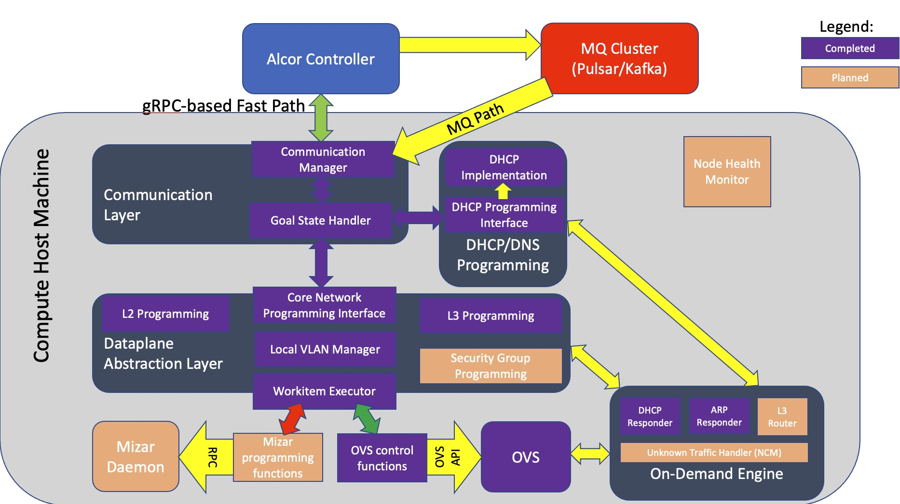

# Alcor Control Agent
Next-gen networking control plane - Alcor Control Agent

* For information about how to use Alcor Control Agent, visit [Getting Started](src/README.md)
* To ask questions, raise feature requests and get assistance from our community, join [Alcor Slack](https://alcor-networking.slack.com/) channels ([invitation](https://join.slack.com/t/alcor-networking/shared_invite/zt-cudckviu-hcsMI4LWB4cRWy4hn3N3oQ) for first-time participant) or [Google Group](https://groups.google.com/forum/#!forum/alcor-dev)
* To report an issue, visit [Issues page](https://https://github.com/futurewei-cloud/alcor-control-agent/issues)

In this README:

- [Introduction](#introduction)
- [Repositories](#repositories)
- [Directory Structure](#directory-structure)
- [Notes](#notes)

## Introduction

The Cloud Fabric Alcor Control Agent (ACA) runs on each host machine. It serves as a stateless proxy between Alcor controller and host machine networking components for control plane operations. Below are the highlevel Agent components.

## Repositories
The Alcor project is divided across a few GitHub repositories.

- [alcor/alcor](https://github.com/futurewei-cloud/alcor):
This is the main repository of Alcor Regional Controller that you are currently looking at.
It hosts controllers' source codes, build and deployment instructions, and various documents that detail the design of Alcor.

- [alcor/alcor_control_agent](https://github.com/futurewei-cloud/alcor-control-agent):
This repository contains source codes for a host-level stateless agent that connects regional controllers to the host data-plane component.
It is responsible for programming on-host data plane with various network configuration for CURD of _VPC, subnet, port, Security group etc._,
 and monitoring network health of containers and VMs on the host.

- [alcor/integration](https://github.com/futurewei-cloud/alcor-int):
The integration repository contains codes and scripts for end-to-end integration of Alcor control plane with popular orchestration platforms and data plane implementations.
We currently support integration with Kubernetes (via CNI plugin) and Mizar Data Plane.
We will continue to integrate with other orchestration systems and data plane implementations.

## Directory Structure
This main repository of Alcor Control Agent is organized as follows:
* build: script and docker files for building
* docs: design documentation
* etc/k8s: k8s integration files
* include: header files
* src: source code
* test: Unit and integration test code

## Notes
* ovs_control.h and ovs_control.cpp is based on https://github.com/openvswitch/ovs/blob/master/utilities/ovs-ofctl.c
* aca_grpc.cpp is based on https://github.com/grpc/grpc/blob/v1.30.0/examples/cpp/route_guide/route_guide_server.cc
* HashMap.h and HashNode.h is based on https://github.com/kshk123/hashMap
