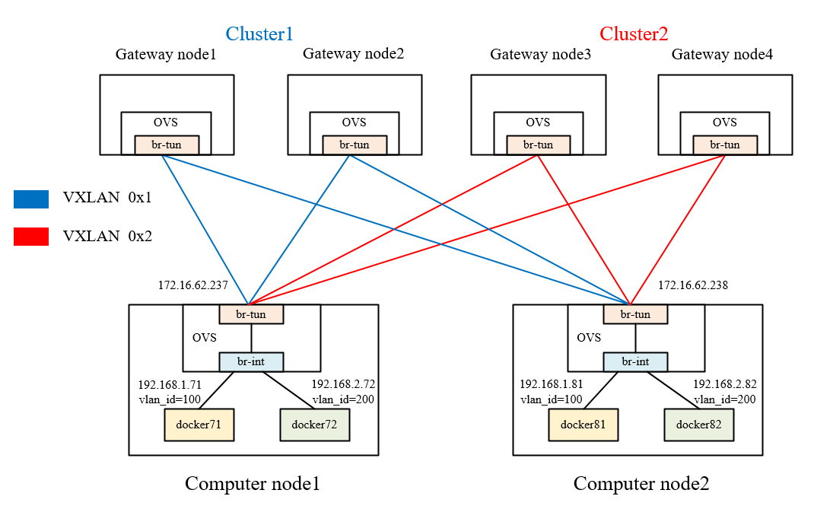

## Manual construction and testing of openflow rule for Zeta integration

### 1. Experimental topology



<p align="center">Figure 1. Experimental topology</p>

#### 1.1 Gateway node

-   Cluster1:
    -   gateway node1 &nbsp;&nbsp; ip: 172.16.62.231
    -   gateway node2 &nbsp;&nbsp; ip: 172.16.62.232
-   Cluster2:
    -   gateway node3 &nbsp;&nbsp; ip: 172.16.62.233
    -   gateway node4 &nbsp;&nbsp; ip: 172.16.62.234

#### 1.2 Computer node

-   computer node1 &nbsp;&nbsp; ip: 172.16.62.237
    -   docker71:   192.168.1.71 &nbsp;&nbsp; vlan_id=100 &nbsp;&nbsp; VXLAN VNI=0x1
    -   docker72:   192.168.2.72 &nbsp;&nbsp; vlan_id=200 &nbsp;&nbsp; VXLAN VNI=0x2

-   computer node2 &nbsp;&nbsp; ip: 172.16.62.238
    -   docker81:   192.168.1.81 &nbsp;&nbsp; vlan_id=100 &nbsp;&nbsp; VXLAN VNI=0x1
    -   docker82:   192.168.2.82 &nbsp;&nbsp; vlan_id=200 &nbsp;&nbsp; VXLAN VNI=0x2


### 2. OVS settings for gateway nodes
Each gateway node adds a br-tun OVS-bridge, and creates VXLAN tunnels connected to each computer node.

-   **gateway node1 (172.16.62.231)**
```
root@gateway1:/# ovs-vsctl add-br br-tun
root@gateway1:/# ovs-vsctl add-port br-tun vxlan237 -- set interface vxlan237 type=vxlan options:remote_ip=172.16.62.237 options:key=flow
root@gateway1:/# ovs-vsctl add-port br-tun vxlan238 -- set interface vxlan238 type=vxlan options:remote_ip=172.16.62.238 options:key=flow
```


-   **gateway node2 (172.16.62.232)**
```
root@gateway2:/# ovs-vsctl add-br br-tun
root@gateway2:/# ovs-vsctl add-port br-tun vxlan237 -- set interface vxlan237 type=vxlan options:remote_ip=172.16.62.237 options:key=flow
root@gateway2:/# ovs-vsctl add-port br-tun vxlan238 -- set interface vxlan238 type=vxlan options:remote_ip=172.16.62.238 options:key=flow
```

-   **gateway node3 (172.16.62.233)**
```
root@gateway3:/# ovs-vsctl add-br br-tun
root@gateway3:/# ovs-vsctl add-port br-tun vxlan237 -- set interface vxlan237 type=vxlan options:remote_ip=172.16.62.237 options:key=flow
root@gateway3:/# ovs-vsctl add-port br-tun vxlan238 -- set interface vxlan238 type=vxlan options:remote_ip=172.16.62.238 options:key=flow
```

-   **gateway node4 (172.16.62.234)**
```
root@gateway4:/# ovs-vsctl add-br br-tun
root@gateway4:/# ovs-vsctl add-port br-tun vxlan237 -- set interface vxlan237 type=vxlan options:remote_ip=172.16.62.237 options:key=flow
root@gateway4:/# ovs-vsctl add-port br-tun vxlan238 -- set interface vxlan238 type=vxlan options:remote_ip=172.16.62.238 options:key=flow
```


### 3. OVS and flow table settings for computer nodes (Gateway forwarding)
#### 3.1 computer node1 (172.16.62.237)

-   **1. Add br-int and br-tun, and create VXLAN tunnels connected to each gateway node.**
```
root@computer7:/# ovs-vsctl add-br br-int
root@computer7:/# ovs-vsctl add-port br-int patch-tun -- set interface patch-tun type=patch options:peer=patch-int
root@computer7:/# ovs-vsctl add-br br-tun
root@computer7:/# ovs-vsctl add-port br-tun patch-int -- set interface patch-int type=patch options:peer=patch-tun

root@computer7:/# ovs-vsctl add-port br-tun vxlan231 -- set interface vxlan231 type=vxlan options:remote_ip=172.16.62.231 options:key=flow
root@computer7:/# ovs-vsctl add-port br-tun vxlan232 -- set interface vxlan232 type=vxlan options:remote_ip=172.16.62.232 options:key=flow
root@computer7:/# ovs-vsctl add-port br-tun vxlan233 -- set interface vxlan233 type=vxlan options:remote_ip=172.16.62.233 options:key=flow
root@computer7:/# ovs-vsctl add-port br-tun vxlan234 -- set interface vxlan234 type=vxlan options:remote_ip=172.16.62.234 options:key=flow
```

-   **2. Start two containers.
Use ovs-docker to add a nic for the container and hang it to the br-int.
Set different vlan_id (100 and 200).**
```
root@computer7:/# docker run -itd --name docker71 --net none --privileged=true ubuntu /bin/bash
root@computer7:/# ovs-docker add-port br-int eth0 docker71 --ipaddress=192.168.1.71/24 --mtu=1450
root@computer7:/# ovs-vsctl show
root@computer7:/# ovs-vsctl set port 3cf61d844bb54_l tag=100

root@computer7:/# docker run -itd --name docker72 --net none --privileged=true ubuntu /bin/bash
root@computer7:/# ovs-docker add-port br-int eth0 docker72 --ipaddress=192.168.2.72/24 --mtu=1450
root@computer7:/# ovs-vsctl show
root@computer7:/# ovs-vsctl set port d51bd7b756384_l tag=200
```

-   **3. Settings for br-int and br-tun are as follows:**
```
root@computer7:/# ovs-vsctl show
da582be9-4de3-40cf-aad2-8def91ca734b
    Bridge br-tun
        Port br-tun
            Interface br-tun
                type: internal
        Port "vxlan234"
            Interface "vxlan234"
                type: vxlan
                options: {key=flow, remote_ip="172.16.62.234"}
        Port "vxlan232"
            Interface "vxlan232"
                type: vxlan
                options: {key=flow, remote_ip="172.16.62.232"}
        Port "vxlan231"
            Interface "vxlan231"
                type: vxlan
                options: {key=flow, remote_ip="172.16.62.231"}
        Port "vxlan233"
            Interface "vxlan233"
                type: vxlan
                options: {key=flow, remote_ip="172.16.62.233"}
        Port patch-int
            Interface patch-int
                type: patch
                options: {peer=patch-tun}
    Bridge br-int
        Port "3cf61d844bb54_l"
            tag: 100
            Interface "3cf61d844bb54_l"
        Port br-int
            Interface br-int
                type: internal
        Port "d51bd7b756384_l"
            tag: 200
            Interface "d51bd7b756384_l"
        Port patch-tun
            Interface patch-tun
                type: patch
                options: {peer=patch-int}
    ovs_version: "2.12.2"
```

-   **4. Add default flow tables for br-tun**
```
# 0 - Delete the existing flow tables in br-tun:
root@computer7:/# ovs-ofctl del-flows br-tun


# 1 - Packet-out flow tables：
# 1.1 - default goes to unicast/multicast table 2:
root@computer7:/# ovs-ofctl add-flow br-tun table=0,in_port="patch-int",priority=1,actions="resubmit(,2)"

# 1.2 - unicast traffic goes to table 20 (direct path, table 0->2->20):
root@computer7:/# ovs-ofctl add-flow br-tun table=2,priority=1,dl_dst=00:00:00:00:00:00/01:00:00:00:00:00,actions="resubmit(,20)"
# 1.2 - table 20 default upload to gateway (table 0->2->20->22):
root@computer7:/# ovs-ofctl add-flow br-tun table=20,priority=1,actions="resubmit(,22)"

# 1.3 - multicast traffic goes to table 22 (upload to gateway, table 0->2->22):
root@computer7:/# ovs-ofctl add-flow br-tun table=2,priority=1,dl_dst=01:00:00:00:00:00/01:00:00:00:00:00,actions="resubmit(,22)"


# 2 - Group table：
root@computer7:/# ovs-ofctl -O OpenFlow13 add-group br-tun group_id=100,type=select,bucket=output:vxlan231,bucket=output:vxlan232
root@computer7:/# ovs-ofctl -O OpenFlow13 add-group br-tun group_id=200,type=select,bucket=output:vxlan233,bucket=output:vxlan234

root@computer7:/# ovs-ofctl add-flow br-tun table=22,priority=50,dl_vlan=100,actions="strip_vlan,load:0x1->NXM_NX_TUN_ID[],group:100"
root@computer7:/# ovs-ofctl add-flow br-tun table=22,priority=50,dl_vlan=200,actions="strip_vlan,load:0x2->NXM_NX_TUN_ID[],group:200"


# 3 - Packet-in flow tables (table 0->4)：
root@computer7:/# ovs-ofctl add-flow br-tun table=0,priority=25,in_port="vxlan231",actions="resubmit(,4)"
root@computer7:/# ovs-ofctl add-flow br-tun table=0,priority=25,in_port="vxlan232",actions="resubmit(,4)"
root@computer7:/# ovs-ofctl add-flow br-tun table=0,priority=25,in_port="vxlan233",actions="resubmit(,4)"
root@computer7:/# ovs-ofctl add-flow br-tun table=0,priority=25,in_port="vxlan234",actions="resubmit(,4)"

root@computer7:/# ovs-ofctl add-flow br-tun table=4,priority=1,tun_id=0x1,actions="mod_vlan_vid:100,output:"patch-int""
root@computer7:/# ovs-ofctl add-flow br-tun table=4,priority=1,tun_id=0x2,actions="mod_vlan_vid:200,output:"patch-int""
```


-   **5. Show default flow tables in br-tun**
```
root@computer7:/# ovs-ofctl dump-flows br-tun
 cookie=0x0, duration=806.968s, table=0, n_packets=0, n_bytes=0, priority=1,in_port="patch-int" actions=resubmit(,2)
 cookie=0x0, duration=41.454s, table=0, n_packets=0, n_bytes=0, priority=25,in_port=vxlan231 actions=resubmit(,4)
 cookie=0x0, duration=35.429s, table=0, n_packets=0, n_bytes=0, priority=25,in_port=vxlan232 actions=resubmit(,4)
 cookie=0x0, duration=29.654s, table=0, n_packets=0, n_bytes=0, priority=25,in_port=vxlan233 actions=resubmit(,4)
 cookie=0x0, duration=23.110s, table=0, n_packets=0, n_bytes=0, priority=25,in_port=vxlan234 actions=resubmit(,4)
 cookie=0x0, duration=186.068s, table=2, n_packets=0, n_bytes=0, priority=1,dl_dst=00:00:00:00:00:00/01:00:00:00:00:00 actions=resubmit(,20)
 cookie=0x0, duration=174.437s, table=2, n_packets=0, n_bytes=0, priority=1,dl_dst=01:00:00:00:00:00/01:00:00:00:00:00 actions=resubmit(,22)
 cookie=0x0, duration=14.078s, table=4, n_packets=0, n_bytes=0, priority=1,tun_id=0x1 actions=mod_vlan_vid:100,output:"patch-int"
 cookie=0x0, duration=7.705s, table=4, n_packets=0, n_bytes=0, priority=1,tun_id=0x2 actions=mod_vlan_vid:200,output:"patch-int"
 cookie=0x0, duration=159.449s, table=20, n_packets=0, n_bytes=0, priority=1 actions=resubmit(,22)
 cookie=0x0, duration=63.974s, table=22, n_packets=0, n_bytes=0, priority=50,dl_vlan=100 actions=strip_vlan,load:0x1->NXM_NX_TUN_ID[],group:100
 cookie=0x0, duration=57.318s, table=22, n_packets=0, n_bytes=0, priority=50,dl_vlan=200 actions=strip_vlan,load:0x2->NXM_NX_TUN_ID[],group:200
```


#### 3.2 computer node2 (172.16.62.238)

-   **1. Add br-int and br-tun, and create VXLAN tunnels connected to each gateway node.**
```
root@computer8:/# ovs-vsctl add-br br-int
root@computer8:/# ovs-vsctl add-port br-int patch-tun -- set interface patch-tun type=patch options:peer=patch-int
root@computer8:/# ovs-vsctl add-br br-tun
root@computer8:/# ovs-vsctl add-port br-tun patch-int -- set interface patch-int type=patch options:peer=patch-tun

root@computer8:/# ovs-vsctl add-port br-tun vxlan231 -- set interface vxlan231 type=vxlan options:remote_ip=172.16.62.231 options:key=flow
root@computer8:/# ovs-vsctl add-port br-tun vxlan232 -- set interface vxlan232 type=vxlan options:remote_ip=172.16.62.232 options:key=flow
root@computer8:/# ovs-vsctl add-port br-tun vxlan233 -- set interface vxlan233 type=vxlan options:remote_ip=172.16.62.233 options:key=flow
root@computer8:/# ovs-vsctl add-port br-tun vxlan234 -- set interface vxlan234 type=vxlan options:remote_ip=172.16.62.234 options:key=flow
```

-   **2. Start two containers.
Use ovs-docker to add a nic for the container and hang it to the br-int.
Set different vlan_id (100 and 200).**
```
root@computer8:/# docker run -itd --name docker81 --net none --privileged=true ubuntu /bin/bash
root@computer8:/# ovs-docker add-port br-int eth0 docker81 --ipaddress=192.168.1.81/24 --mtu=1450
root@computer8:/# ovs-vsctl show
root@computer8:/# ovs-vsctl set port 28acf2cb39734_l tag=100

root@computer8:/# docker run -itd --name docker82 --net none --privileged=true ubuntu /bin/bash
root@computer8:/# ovs-docker add-port br-int eth0 docker82 --ipaddress=192.168.2.82/24 --mtu=1450
root@computer8:/# ovs-vsctl show
root@computer8:/# ovs-vsctl set port 0d5d11dd5a6d4_l tag=200
```

-   **3. Settings for br-int and br-tun are as follows:**
```
root@computer8:/# ovs-vsctl show
1846fa36-a146-45b6-8f9c-b3344f2aeda7
    Bridge br-int
        Port "28acf2cb39734_l"
            tag: 100
            Interface "28acf2cb39734_l"
        Port br-int
            Interface br-int
                type: internal
        Port "0d5d11dd5a6d4_l"
            tag: 200
            Interface "0d5d11dd5a6d4_l"
        Port patch-tun
            Interface patch-tun
                type: patch
                options: {peer=patch-int}
    Bridge br-tun
        Port "vxlan232"
            Interface "vxlan232"
                type: vxlan
                options: {key=flow, remote_ip="172.16.62.232"}
        Port patch-int
            Interface patch-int
                type: patch
                options: {peer=patch-tun}
        Port "vxlan233"
            Interface "vxlan233"
                type: vxlan
                options: {key=flow, remote_ip="172.16.62.233"}
        Port "vxlan231"
            Interface "vxlan231"
                type: vxlan
                options: {key=flow, remote_ip="172.16.62.231"}
        Port br-tun
            Interface br-tun
                type: internal
        Port "vxlan234"
            Interface "vxlan234"
                type: vxlan
                options: {key=flow, remote_ip="172.16.62.234"}
    ovs_version: "2.9.5"
```

-   **4. Add flow tables for br-tun**
```
# 0 - Delete the existing flow tables in br-tun:
root@computer8:/# ovs-ofctl del-flows br-tun


# 1 - Packet-out flow tables：
# 1.1 - default goes to unicast/multicast table 2:
root@computer8:/# ovs-ofctl add-flow br-tun table=0,in_port="patch-int",priority=1,actions="resubmit(,2)"

# 1.2 - unicast traffic goes to table 20 (direct path, table 0->2->20):
root@computer8:/# ovs-ofctl add-flow br-tun table=2,priority=1,dl_dst=00:00:00:00:00:00/01:00:00:00:00:00,actions="resubmit(,20)"
# 1.2 - table 20 default upload to gateway (table 0->2->20->22):
root@computer8:/# ovs-ofctl add-flow br-tun table=20,priority=1,actions="resubmit(,22)"

# 1.3 - multicast traffic goes to table 22 (upload to gateway, table 0->2->22):
root@computer8:/# ovs-ofctl add-flow br-tun table=2,priority=1,dl_dst=01:00:00:00:00:00/01:00:00:00:00:00,actions="resubmit(,22)"


# 2 - Group table：
root@computer8:/# ovs-ofctl -O OpenFlow13 add-group br-tun group_id=100,type=select,bucket=output:vxlan231,bucket=output:vxlan232
root@computer8:/# ovs-ofctl -O OpenFlow13 add-group br-tun group_id=200,type=select,bucket=output:vxlan233,bucket=output:vxlan234

root@computer8:/# ovs-ofctl add-flow br-tun table=22,priority=50,dl_vlan=100,actions="strip_vlan,load:0x1->NXM_NX_TUN_ID[],group:100"
root@computer8:/# ovs-ofctl add-flow br-tun table=22,priority=50,dl_vlan=200,actions="strip_vlan,load:0x2->NXM_NX_TUN_ID[],group:200"


# 3 - Packet-in flow tables (table 0->4)：
root@computer8:/# ovs-ofctl add-flow br-tun table=0,priority=25,in_port="vxlan231",actions="resubmit(,4)"
root@computer8:/# ovs-ofctl add-flow br-tun table=0,priority=25,in_port="vxlan232",actions="resubmit(,4)"
root@computer8:/# ovs-ofctl add-flow br-tun table=0,priority=25,in_port="vxlan233",actions="resubmit(,4)"
root@computer8:/# ovs-ofctl add-flow br-tun table=0,priority=25,in_port="vxlan234",actions="resubmit(,4)"

root@computer8:/# ovs-ofctl add-flow br-tun table=4,priority=1,tun_id=0x1,actions="mod_vlan_vid:100,output:"patch-int""
root@computer8:/# ovs-ofctl add-flow br-tun table=4,priority=1,tun_id=0x2,actions="mod_vlan_vid:200,output:"patch-int""
```

-   **5. Show default flow tables in br-tun**
```
root@computer8:/# ovs-ofctl dump-flows br-tun
 cookie=0x0, duration=129.879s, table=0, n_packets=0, n_bytes=0, priority=1,in_port="patch-int" actions=resubmit(,2)
 cookie=0x0, duration=75.727s, table=0, n_packets=0, n_bytes=0, priority=25,in_port=vxlan231 actions=resubmit(,4)
 cookie=0x0, duration=69.486s, table=0, n_packets=0, n_bytes=0, priority=25,in_port=vxlan232 actions=resubmit(,4)
 cookie=0x0, duration=63.983s, table=0, n_packets=0, n_bytes=0, priority=25,in_port=vxlan233 actions=resubmit(,4)
 cookie=0x0, duration=18.685s, table=0, n_packets=0, n_bytes=0, priority=25,in_port=vxlan234 actions=resubmit(,4)
 cookie=0x0, duration=123.823s, table=2, n_packets=0, n_bytes=0, priority=1,dl_dst=00:00:00:00:00:00/01:00:00:00:00:00 actions=resubmit(,20)
 cookie=0x0, duration=117.255s, table=2, n_packets=0, n_bytes=0, priority=1,dl_dst=01:00:00:00:00:00/01:00:00:00:00:00 actions=resubmit(,22)
 cookie=0x0, duration=13.270s, table=4, n_packets=0, n_bytes=0, priority=1,tun_id=0x1 actions=mod_vlan_vid:100,output:"patch-int"
 cookie=0x0, duration=7.172s, table=4, n_packets=0, n_bytes=0, priority=1,tun_id=0x2 actions=mod_vlan_vid:200,output:"patch-int"
 cookie=0x0, duration=59.449s, table=20, n_packets=0, n_bytes=0, priority=1 actions=resubmit(,22)
 cookie=0x0, duration=98.415s, table=22, n_packets=0, n_bytes=0, priority=50,dl_vlan=100 actions=strip_vlan,load:0x1->NXM_NX_TUN_ID[],group:100
 cookie=0x0, duration=90.679s, table=22, n_packets=0, n_bytes=0, priority=50,dl_vlan=200 actions=strip_vlan,load:0x2->NXM_NX_TUN_ID[],group:200
```


### 4. Test results (Gateway forwarding)
-   **1. Containers with the same vlan_id can ping each other.**
```
# docker71 (192.168.1.71, vlan_id=100)  ping  docker81 (192.168.1.81, vlan_id=100), success.
root@computer7:/# docker attach docker71
root@c2447255947a:/# ping 192.168.1.81 -c 4
PING 192.168.1.81 (192.168.1.81) 56(84) bytes of data.
64 bytes from 192.168.1.81: icmp_seq=1 ttl=64 time=5.46 ms
64 bytes from 192.168.1.81: icmp_seq=2 ttl=64 time=1.39 ms
64 bytes from 192.168.1.81: icmp_seq=3 ttl=64 time=1.06 ms
64 bytes from 192.168.1.81: icmp_seq=4 ttl=64 time=0.986 ms

--- 192.168.1.81 ping statistics ---
4 packets transmitted, 4 received, 0% packet loss, time 3005ms
rtt min/avg/max/mdev = 0.986/2.221/5.457/1.873 ms


# docker72 (192.168.2.72, vlan_id=200)  ping  docker82 (192.168.2.82, vlan_id=200), success.
root@computer7:/# docker attach docker72
root@70793d5327ae:/# ping 192.168.2.82 -c 4
PING 192.168.2.82 (192.168.2.82) 56(84) bytes of data.
64 bytes from 192.168.2.82: icmp_seq=1 ttl=64 time=5.82 ms
64 bytes from 192.168.2.82: icmp_seq=2 ttl=64 time=0.971 ms
64 bytes from 192.168.2.82: icmp_seq=3 ttl=64 time=0.929 ms
64 bytes from 192.168.2.82: icmp_seq=4 ttl=64 time=1.14 ms

--- 192.168.2.82 ping statistics ---
4 packets transmitted, 4 received, 0% packet loss, time 3005ms
rtt min/avg/max/mdev = 0.929/2.215/5.817/2.081 ms

```

-   **2. Observe the n_packets increase of the "actions=...,group:100/200" rule, that means the corresponding group table works.**
```
root@computer7:/# ovs-ofctl dump-flows br-tun
 ......
 cookie=0x0, duration=1299.225s, table=30, n_packets=6, n_bytes=476, priority=50,dl_vlan=100 actions=strip_vlan,load:0x1->NXM_NX_TUN_ID[],group:100
 cookie=0x0, duration=1293.418s, table=30, n_packets=6, n_bytes=476, priority=50,dl_vlan=200 actions=strip_vlan,load:0x2->NXM_NX_TUN_ID[],group:200
 ......
```


-   **3. Containers with different vlan_id can not ping each other.**
```
# docker71 (192.168.1.71, vlan_id=100)  ping  docker82 (192.168.2.82, vlan_id=200), fail.
root@computer7:/# docker attach docker71
root@c2447255947a:/# ping 192.168.2.82
PING 192.168.2.82 (192.168.2.82) 56(84) bytes of data.
From 192.168.1.71 icmp_seq=1 Destination Host Unreachable
From 192.168.1.71 icmp_seq=2 Destination Host Unreachable
From 192.168.1.71 icmp_seq=3 Destination Host Unreachable
^C
--- 192.168.2.82 ping statistics ---
4 packets transmitted, 0 received, +3 errors, 100% packet loss, time 3051ms
pipe 4
```


### 5. Test results (unicast/multicast table)
-   **1. docker71 ping docker81**
    -   The first packet of source (docker71) is ARP request multicast. **(table 0->2->22)**
    -   And then is ICMP unicast. Since there is no direct path at this time, it will still be uploaded to the gateway. **(table 0->2->20->22)**
    -   The first packet of destination (docker72) is ARP reply unicast and then is ICMP unicast. **(table 0->2->20->22)**


-   **2. Observe the n_packets increase of the unicast/multicast rule.**
```
root@computer7:/# ovs-ofctl dump-flows br-tun
 ......
 cookie=0x0, duration=1233.773s, table=2, n_packets=10, n_bytes=924, priority=1,dl_dst=00:00:00:00:00:00/01:00:00:00:00:00 actions=resubmit(,20)
 cookie=0x0, duration=1224.997s, table=2, n_packets=12, n_bytes=632, priority=1,dl_dst=01:00:00:00:00:00/01:00:00:00:00:00 actions=resubmit(,22)
 cookie=0x0, duration=416.745s, table=20, n_packets=10, n_bytes=924, priority=1 actions=resubmit(,22)
 cookie=0x0, duration=1169.491s, table=22, n_packets=22, n_bytes=1556, priority=50,dl_vlan=100 actions=strip_vlan,load:0x1->NXM_NX_TUN_ID[],group:100
 cookie=0x0, duration=1162.380s, table=22, n_packets=0, n_bytes=0, priority=50,dl_vlan=200 actions=strip_vlan,load:0x2->NXM_NX_TUN_ID[],group:200


root@computer7:/# ovs-ofctl dump-flows br-tun
 ......
 cookie=0x0, duration=3503.911s, table=2, n_packets=21, n_bytes=1512, priority=1,dl_dst=00:00:00:00:00:00/01:00:00:00:00:00 actions=resubmit(,20)
 cookie=0x0, duration=3497.343s, table=2, n_packets=1, n_bytes=42, priority=1,dl_dst=01:00:00:00:00:00/01:00:00:00:00:00 actions=resubmit(,22)
 cookie=0x0, duration=2319.631s, table=20, n_packets=21, n_bytes=1386, priority=1 actions=resubmit(,22)
 cookie=0x0, duration=3000.789s, table=22, n_packets=22, n_bytes=1428, priority=50,dl_vlan=100 actions=strip_vlan,load:0x1->NXM_NX_TUN_ID[],group:100
 cookie=0x0, duration=2993.572s, table=22, n_packets=0, n_bytes=0, priority=50,dl_vlan=200 actions=strip_vlan,load:0x2->NXM_NX_TUN_ID[],group:200

```


### 6. OVS and flow table settings for direct path
After the first packet from docker71 send to the gateway node, the gateway node will
send a OAM packet to the compute node7 and a direct path will be built.

#### 6.1 computer node1 (172.16.62.237)

-   **1. Create VXLAN tunnel connected to computer node2.**
```
root@computer7:/# ovs-vsctl add-port br-tun vxlan238 -- set interface vxlan238 type=vxlan options:remote_ip=172.16.62.238 options:key=flow
```

-   **2. Add flow tables for direct path**
```
# Packet-out flow tables：
root@computer7:/# ovs-ofctl add-flow br-tun table=20,priority=50,dl_vlan=100,ip,nw_src=192.168.1.71,nw_dst=192.168.1.81,actions="strip_vlan,load:0x1->NXM_NX_TUN_ID[],output:"vxlan238""

# Packet-in flow tables：
root@computer7:/# ovs-ofctl add-flow br-tun table=0,priority=25,in_port="vxlan238",actions="resubmit(,4)"
```


#### 6.2 computer node2 (172.16.62.238)

-   **1. Create VXLAN tunnel connected to computer node1.**
```
root@computer8:/# ovs-vsctl add-port br-tun vxlan237 -- set interface vxlan237 type=vxlan options:remote_ip=172.16.62.237 options:key=flow
```

-   **2. Add flow tables for direct path**
```
# Packet-out flow tables：
root@computer8:/# ovs-ofctl add-flow br-tun table=20,priority=50,dl_vlan=100,ip,nw_src=192.168.1.81,nw_dst=192.168.1.71,actions="strip_vlan,load:0x1->NXM_NX_TUN_ID[],output:"vxlan237""

# Packet-in flow tables：
root@computer8:/# ovs-ofctl add-flow br-tun table=0,priority=25,in_port="vxlan237",actions="resubmit(,4)"
```


#### 6.3 Test results (direct path)
-   **1. Containers with vlan_id=100 can ping each other.**
```
# docker71 (192.168.1.71, vlan_id=100)  ping  docker81 (192.168.1.81, vlan_id=100), success.
root@computer7:/# docker attach docker71
root@c2447255947a:/# ping 192.168.1.81 -c 4
PING 192.168.1.81 (192.168.1.81) 56(84) bytes of data.
64 bytes from 192.168.1.81: icmp_seq=1 ttl=64 time=5.46 ms
64 bytes from 192.168.1.81: icmp_seq=2 ttl=64 time=1.39 ms
64 bytes from 192.168.1.81: icmp_seq=3 ttl=64 time=1.06 ms
64 bytes from 192.168.1.81: icmp_seq=4 ttl=64 time=0.986 ms

--- 192.168.1.81 ping statistics ---
4 packets transmitted, 4 received, 0% packet loss, time 3005ms
rtt min/avg/max/mdev = 0.986/2.221/5.457/1.873 ms
```

-   **2. Observe the n_packets increase of the on demand direct path rule, 
that means the direct path works.**
```
root@computer7:/# ovs-ofctl dump-flows br-tun
 ......
 cookie=0x0, duration=69.456s, table=20, n_packets=4, n_bytes=392, priority=50,ip,dl_vlan=100,nw_src=192.168.1.71,nw_dst=192.168.1.81 actions=strip_vlan,load:0x1->NXM_NX_TUN_ID[],output:vxlan238 
 ......
 
 
root@computer8:/# ovs-ofctl dump-flows br-tun
 ......
 cookie=0x0, duration=106.766s, table=20, n_packets=4, n_bytes=392, priority=50,ip,dl_vlan=100,nw_src=192.168.1.81,nw_dst=192.168.1.71 actions=strip_vlan,load:0x1->NXM_NX_TUN_ID[],output:vxlan237
 ......
```