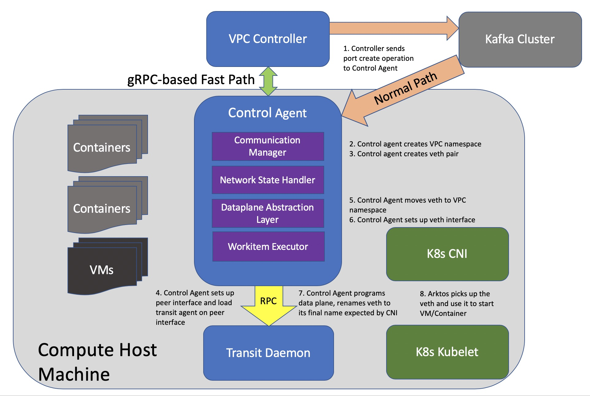
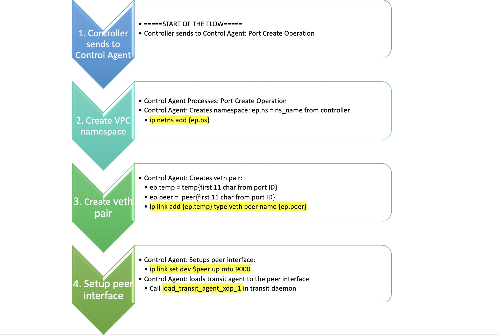

= Interface with Arktos
Eric Li <sze.li@futurewei.com>
v0.1, 2020-03-20
:toc: right

The below diagrams shows the interaction between components and work flow for Arktos, Alcor and Mizar.

image::images/Agent_flow2.JPG["Agent flow 2", width=800, link="images/Agent_flow2.JPG"]