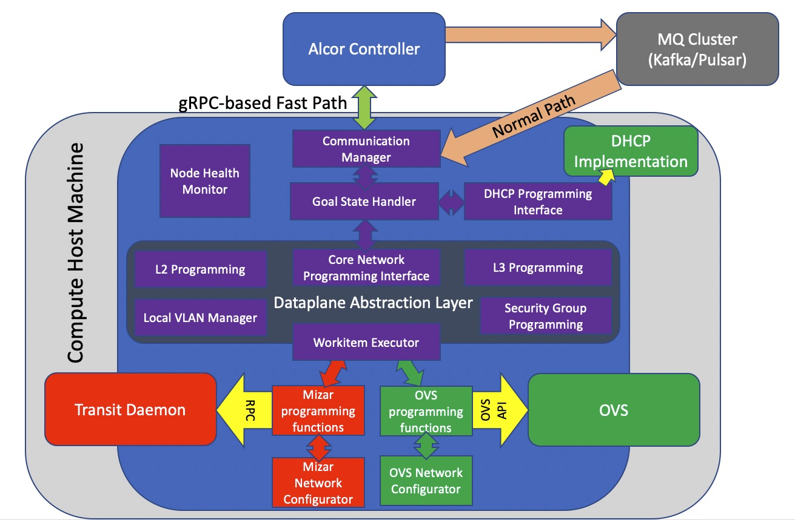
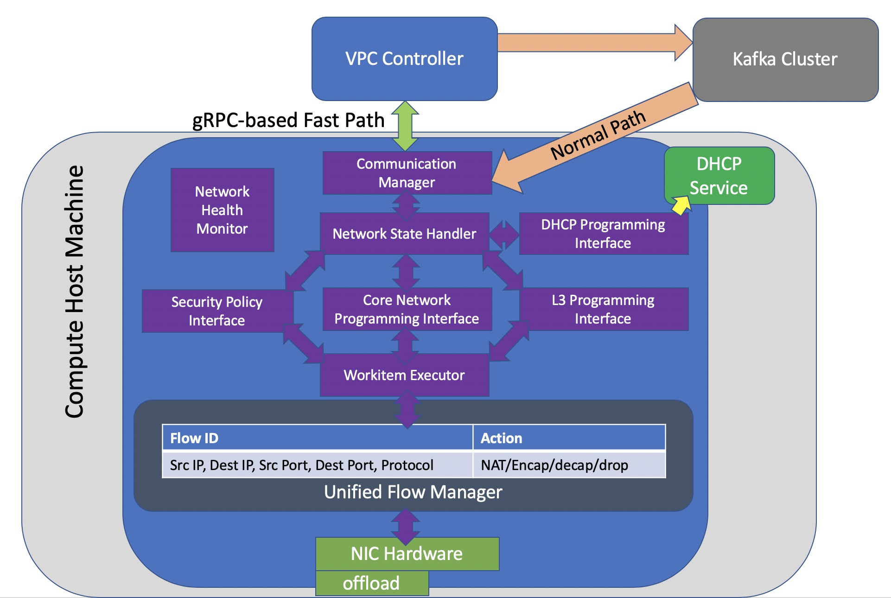

= Alcor Control Agent Major Components
Eric Li <sze.li@futurewei.com>
v0.1, 2020-03-20
:toc: right

[width="100%",options="header"]
|====================
|Title|Authors|Version
|Alcor Control Agent Major Components|@erictheone|0.1
|====================

== Communication Manager

This is the interface between Alcor VPC Controller and Alcor Control Agent(ACA). Kafka or gRPC (for control fast path) was used to send goal state messages from Alcor VPC Controllers to ACA running on each compute host. ACA subscribes to topics published by Alcor VPC Controller in Kafka in order to receive targetted message to specific ACA. ACA can also publish (response/health/error) information back to Alcor VPC Controllers through Kafka or gRPC.

== Network State Handler

This module deserializes the Kafka message from Alcor VPC Controller, determine the action(s) needed from the content of the goal state message and then involve the corresponding interface(s) to handle the requests.

== Dataplane Abstraction Layer

To support different dataplane implementations (e.g. OVS and Mizar), abstraction layer was implemented in ACA. All the interfaces here are the same for all dataplane. 

=== Core Network Programming Interface

This interface is used to program VPC/Subnet/Port configurations on compute hosts. Based on the ACA startup configuration, it will also determine the network type like VxLAN or VLAN and default to VxLAN. 

=== L3 Programming Interface

This interface is used to program L3 routing information, it also including programming of network ACLs on routers. The current neutron implementation uses NAT with iptables on connection between br-int and br-ex bridges. We can consider other solutions like flow based traffic handling or even offload it to hardware.

=== DHCP Programming Interface

This interface is used to program DHCP service needed for VM/Container that requests dynamic IP address. It talks to a dhcp service, likely dnsmasq, and programmed it with known mac address to IP mapping as new ports were assigned by Alcor server.

=== Security Policy Interface

This interface is responsible to configure and update the security group policy on vPorts connected to VM/Container. The current neutron implementation uses linux brige and iptable rule. We can consider other solutions like flow based or label based traffic marking to apply the policy at the lower layer or even offload to hardware.

=== QoS (Metering) Interface

Responsible to manage Networking QoS, to be done in software or hardware. Out of scope for the current design.

=== Work Item Executor

Work item executor is used to execute the configuration updates for different dataplane implementation. It runs the workitems in parallel by default. There is a huge performance improvement when updating 10s or 100s of ports in parallel instead of updating serially based on data. 

Below is an example of how parallel port provision (create) operation would look like:
[source,console]
------------------------------------------------------------
[METRICS] Elapsed time for message total operation took: 23478448 nanoseconds or 23 milliseconds
Port State(0) took: 9416690 nanoseconds or 9 milliseconds
Port State(1) took: 10072921 nanoseconds or 10 milliseconds
Port State(2) took: 10360112 nanoseconds or 10 milliseconds
Port State(3) took: 10428148 nanoseconds or 10 milliseconds
Port State(4) took: 11855690 nanoseconds or 11 milliseconds
Port State(5) took: 11567930 nanoseconds or 11 milliseconds
Port State(6) took: 12690876 nanoseconds or 12 milliseconds
Port State(7) took: 11301110 nanoseconds or 11 milliseconds
Port State(8) took: 11171870 nanoseconds or 11 milliseconds
Port State(9) took: 12853241 nanoseconds or 12 milliseconds
Average Port Create of 10 took: 11171858 nanoseconds or 11 milliseconds
------------------------------------------------------------

== Unified Flow Manager

As physical NIC reached 40G and targetting for 100G/200G speed, we cannot rely on host CPU power to process network packets as it would become bottleneck for network performance. With many components (Router/NACL/Security Policy) needed to inspect and modify network packages based on flows, we need to have a unified flow manager to centralize all the flow rules with the plan to offload the processing of it in NIC hardware. This is needed to support the performance and latency requirement for next generation SDN datacenter. Note that this is need to support the current network offload features like SRIOV.

== Network Health Monitor

We like to use netdata as our monitoring solution which provides many of the important matrix tracking by default installation. On top of that, we want to provide additional Alcor specific matrix collection to monitor:

. Network Health - can network traffic go through?
. Network Component/agent Health - is OVS running?
. Network Usage - are we bottlenecked on the 40G physical NIC?
. Network Performance - is the customer traffic going though with no latency?

== Log Manager

The log should at least contain a timestamp, source file name and line number, message. The ACA code should be able to specify the log level and can configure the targetted log level at runtime.
Syslog is a good target framework, it is a proven mechanism in linux and it is https://askubuntu.com/questions/184949/how-do-i-limit-the-size-of-my-syslog[configurable for our needs]. See reference session for more information. <<logging>>

[bibliography]
== References

- [[[logging,1]]] Logging in Linux: https://stackoverflow.com/questions/158457/daemon-logging-in-linux