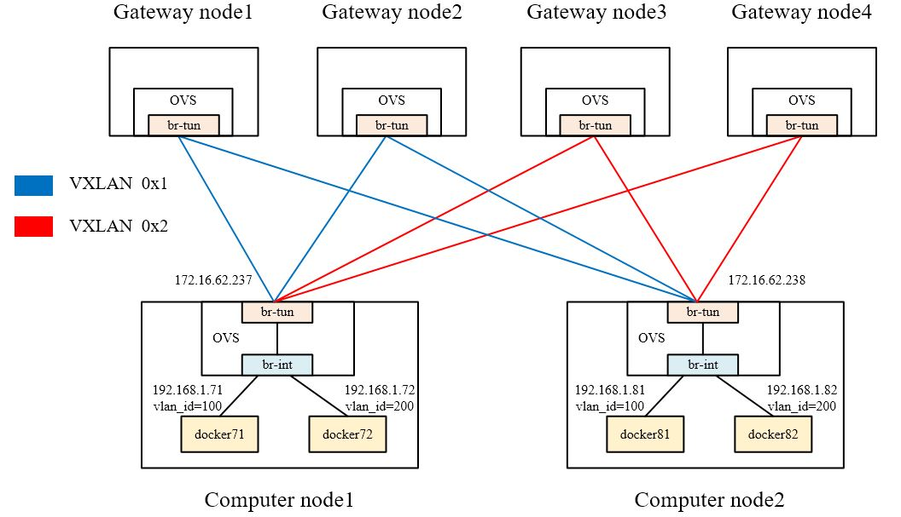

## Manual construction and testing of openflow rule for Zeta integration

### 1. Experimental topology



<p align="center">Figure 1. Experimental topology</p>

#### 1.1 Gateway node

-   gateway node1 &nbsp;&nbsp; ip: 172.16.62.231
-   gateway node2 &nbsp;&nbsp; ip: 172.16.62.232
-   gateway node3 &nbsp;&nbsp; ip: 172.16.62.233
-   gateway node4 &nbsp;&nbsp; ip: 172.16.62.234

#### 1.2 Computer node

-   computer node1 &nbsp;&nbsp; ip: 172.16.62.237
    -   docker71:   192.168.1.71 &nbsp;&nbsp; vlan=100 &nbsp;&nbsp; tun_id=0x1
    -   docker72:   192.168.1.72 &nbsp;&nbsp; vlan=200 &nbsp;&nbsp; tun_id=0x2

-   computer node2 &nbsp;&nbsp; ip: 172.16.62.238
    -   docker81:   192.168.1.81 &nbsp;&nbsp; vlan=100 &nbsp;&nbsp; tun_id=0x1
    -   docker82:   192.168.1.82 &nbsp;&nbsp; vlan=200 &nbsp;&nbsp; tun_id=0x2


### 2. OVS settings for gateway nodes
Each gateway node adds a br-tun OVS-bridge, and creates VXLAN tunnels connected to each computer node.

-   **gateway node1 (172.16.62.231)**
```
root@gateway1:/# ovs-vsctl add-br br-tun
root@gateway1:/# ovs-vsctl add-port br-tun vxlan237 -- set interface vxlan237 type=vxlan options:remote_ip=172.16.62.237 options:key=flow
root@gateway1:/# ovs-vsctl add-port br-tun vxlan238 -- set interface vxlan238 type=vxlan options:remote_ip=172.16.62.238 options:key=flow
```


-   **gateway node2 (172.16.62.232)**
```
root@gateway2:/# ovs-vsctl add-br br-tun
root@gateway2:/# ovs-vsctl add-port br-tun vxlan237 -- set interface vxlan237 type=vxlan options:remote_ip=172.16.62.237 options:key=flow
root@gateway2:/# ovs-vsctl add-port br-tun vxlan238 -- set interface vxlan238 type=vxlan options:remote_ip=172.16.62.238 options:key=flow
```

-   **gateway node3 (172.16.62.233)**
```
root@gateway3:/# ovs-vsctl add-br br-tun
root@gateway3:/# ovs-vsctl add-port br-tun vxlan237 -- set interface vxlan237 type=vxlan options:remote_ip=172.16.62.237 options:key=flow
root@gateway3:/# ovs-vsctl add-port br-tun vxlan238 -- set interface vxlan238 type=vxlan options:remote_ip=172.16.62.238 options:key=flow
```

-   **gateway node4 (172.16.62.234)**
```
root@gateway4:/# ovs-vsctl add-br br-tun
root@gateway4:/# ovs-vsctl add-port br-tun vxlan237 -- set interface vxlan237 type=vxlan options:remote_ip=172.16.62.237 options:key=flow
root@gateway4:/# ovs-vsctl add-port br-tun vxlan238 -- set interface vxlan238 type=vxlan options:remote_ip=172.16.62.238 options:key=flow
```


### 3. OVS and flow table settings for computer nodes
#### 3.1 computer node1 (172.16.62.237)

-   **1. Add br-int and br-tun, and  creates VXLAN tunnels connected to each gateway node.**
```
root@computer7:/# ovs-vsctl add-br br-int
root@computer7:/# ovs-vsctl add-port br-int patch-tun -- set interface patch-tun type=patch options:peer=patch-int
root@computer7:/# ovs-vsctl add-br br-tun
root@computer7:/# ovs-vsctl add-port br-tun patch-int -- set interface patch-int type=patch options:peer=patch-tun

root@computer7:/# ovs-vsctl add-port br-tun vxlan231 -- set interface vxlan231 type=vxlan options:remote_ip=172.16.62.231 options:key=flow
root@computer7:/# ovs-vsctl add-port br-tun vxlan232 -- set interface vxlan232 type=vxlan options:remote_ip=172.16.62.232 options:key=flow
root@computer7:/# ovs-vsctl add-port br-tun vxlan233 -- set interface vxlan233 type=vxlan options:remote_ip=172.16.62.233 options:key=flow
root@computer7:/# ovs-vsctl add-port br-tun vxlan234 -- set interface vxlan234 type=vxlan options:remote_ip=172.16.62.234 options:key=flow
```

-   **2. Start two containers.
Use ovs-docker to add a nic for the container and hang it to the br-int.
Set different vlan_id (100 and 200).**
```
root@computer7:/# docker run -itd --name docker71 --net none ubuntu /bin/bash
root@computer7:/# ovs-docker add-port br-int eth0 docker71 --ipaddress=192.168.1.71/24
root@computer7:/# ovs-vsctl show
root@computer7:/# ovs-vsctl set port 2f5963fc1d9e4_l tag=100

root@computer7:/# docker run -itd --name docker72 --net none ubuntu /bin/bash
root@computer7:/# ovs-docker add-port br-int eth0 docker72 --ipaddress=192.168.1.72/24
root@computer7:/# ovs-vsctl show
root@computer7:/# ovs-vsctl set port f710571459954_l tag=200
```

-   **3. Settings for br-int and br-tun are as follows:**
```
root@computer7:/# ovs-vsctl show
da582be9-4de3-40cf-aad2-8def91ca734b
    Bridge br-tun
        Port br-tun
            Interface br-tun
                type: internal
        Port patch-int
            Interface patch-int
                type: patch
                options: {peer=patch-tun}
        Port "vxlan233"
            Interface "vxlan233"
                type: vxlan
                options: {key=flow, remote_ip="172.16.62.233"}
        Port "vxlan232"
            Interface "vxlan232"
                type: vxlan
                options: {key=flow, remote_ip="172.16.62.232"}
        Port "vxlan234"
            Interface "vxlan234"
                type: vxlan
                options: {key=flow, remote_ip="172.16.62.234"}
        Port "vxlan231"
            Interface "vxlan231"
                type: vxlan
                options: {key=flow, remote_ip="172.16.62.231"}
    Bridge br-int
        Port patch-tun
            Interface patch-tun
                type: patch
                options: {peer=patch-int}
        Port "ba22bbbd1b424_l"
            tag: 200
            Interface "ba22bbbd1b424_l"
        Port "2f5963fc1d9e4_l"
            tag: 100
            Interface "2f5963fc1d9e4_l"
        Port br-int
            Interface br-int
                type: internal
    ovs_version: "2.12.2"
```

-   **4. Add flow tables for br-tun**
```
# Packet-out flow tables：
root@computer7:/# ovs-ofctl add-flow br-tun table=0,in_port="patch-int",priority=1,actions="resubmit(,2)"

root@computer7:/# ovs-ofctl add-flow br-tun table=2,priority=0,dl_dst=00:00:00:00:00:00/01:00:00:00:00:00,actions="resubmit(,20)"
root@computer7:/# ovs-ofctl add-flow br-tun table=2,priority=0,dl_dst=01:00:00:00:00:00/01:00:00:00:00:00,actions="resubmit(,22)"

root@computer7:/# ovs-ofctl add-flow br-tun table=20,priority=0,actions="resubmit(,22)"


# Group table：
root@computer7:/# ovs-ofctl -O OpenFlow13 add-group br-tun group_id=100,type=select,bucket=output:vxlan231,bucket=output:vxlan232
root@computer7:/# ovs-ofctl -O OpenFlow13 add-group br-tun group_id=200,type=select,bucket=output:vxlan233,bucket=output:vxlan234

root@computer7:/# ovs-ofctl add-flow br-tun table=22,priority=1,dl_vlan=100,actions="strip_vlan,load:0x1->NXM_NX_TUN_ID[],group:100"
root@computer7:/# ovs-ofctl add-flow br-tun table=22,priority=1,dl_vlan=200,actions="strip_vlan,load:0x2->NXM_NX_TUN_ID[],group:200"


# Packet-in flow tables：
root@computer7:/# ovs-ofctl add-flow br-tun table=0,priority=1,in_port="vxlan231",actions="resubmit(,4)"
root@computer7:/# ovs-ofctl add-flow br-tun table=0,priority=1,in_port="vxlan232",actions="resubmit(,4)"
root@computer7:/# ovs-ofctl add-flow br-tun table=0,priority=1,in_port="vxlan233",actions="resubmit(,4)"
root@computer7:/# ovs-ofctl add-flow br-tun table=0,priority=1,in_port="vxlan234",actions="resubmit(,4)"

root@computer7:/# ovs-ofctl add-flow br-tun table=4,priority=1,tun_id=0x1,actions="mod_vlan_vid:100,resubmit(,10)"
root@computer7:/# ovs-ofctl add-flow br-tun table=4,priority=1,tun_id=0x2,actions="mod_vlan_vid:200,resubmit(,10)"
root@computer7:/# ovs-ofctl add-flow br-tun table=4,priority=0,actions=drop

root@computer7:/# ovs-ofctl add-flow br-tun table=10,priority=1,actions="learn(table=20,hard_timeout=300,priority=1,cookie=0x0,NXM_OF_VLAN_TCI[0..11],NXM_OF_ETH_DST[]=NXM_OF_ETH_SRC[],load:0->NXM_OF_VLAN_TCI[],load:NXM_NX_TUN_ID[]->NXM_NX_TUN_ID[],output:OXM_OF_IN_PORT[]),output:"patch-int""
```


#### 3.1 computer node2 (172.16.62.238)

-   **1. Add br-int and br-tun, and  creates VXLAN tunnels connected to each gateway node.**
```
root@computer8:/# ovs-vsctl add-br br-int
root@computer8:/# ovs-vsctl add-port br-int patch-tun -- set interface patch-tun type=patch options:peer=patch-int
root@computer8:/# ovs-vsctl add-br br-tun
root@computer8:/# ovs-vsctl add-port br-tun patch-int -- set interface patch-int type=patch options:peer=patch-tun

root@computer8:/# ovs-vsctl add-port br-tun vxlan231 -- set interface vxlan231 type=vxlan options:remote_ip=172.16.62.231 options:key=flow
root@computer8:/# ovs-vsctl add-port br-tun vxlan232 -- set interface vxlan232 type=vxlan options:remote_ip=172.16.62.232 options:key=flow
root@computer8:/# ovs-vsctl add-port br-tun vxlan233 -- set interface vxlan233 type=vxlan options:remote_ip=172.16.62.233 options:key=flow
root@computer8:/# ovs-vsctl add-port br-tun vxlan234 -- set interface vxlan234 type=vxlan options:remote_ip=172.16.62.234 options:key=flow
```

-   **2. Start two containers.
Use ovs-docker to add a nic for the container and hang it to the br-int.
Set different vlan_id (100 and 200).**
```
root@computer8:/# docker run -itd --name docker81 --net none ubuntu /bin/bash
root@computer8:/# ovs-docker add-port br-int eth0 docker81 --ipaddress=192.168.1.81/24
root@computer8:/# ovs-vsctl show
root@computer8:/# ovs-vsctl set port 50521c67db044_l tag=100

root@computer8:/# docker run -itd --name docker82 --net none ubuntu /bin/bash
root@computer8:/# ovs-docker add-port br-int eth0 docker82 --ipaddress=192.168.1.82/24
root@computer8:/# ovs-vsctl show
root@computer8:/# ovs-vsctl set port f710571459954_l tag=200
```

-   **3. Settings for br-int and br-tun are as follows:**
```
root@computer8:/# ovs-vsctl show
1846fa36-a146-45b6-8f9c-b3344f2aeda7
    Bridge br-tun
        Port br-tun
            Interface br-tun
                type: internal
        Port "vxlan234"
            Interface "vxlan234"
                type: vxlan
                options: {key=flow, remote_ip="172.16.62.234"}
        Port "vxlan231"
            Interface "vxlan231"
                type: vxlan
                options: {key=flow, remote_ip="172.16.62.231"}
        Port "vxlan233"
            Interface "vxlan233"
                type: vxlan
                options: {key=flow, remote_ip="172.16.62.233"}
        Port "vxlan232"
            Interface "vxlan232"
                type: vxlan
                options: {key=flow, remote_ip="172.16.62.232"}
        Port patch-int
            Interface patch-int
                type: patch
                options: {peer=patch-tun}
    Bridge br-int
        Port "8d875f94ad034_l"
            tag: 200
            Interface "8d875f94ad034_l"
        Port patch-tun
            Interface patch-tun
                type: patch
                options: {peer=patch-int}
        Port "50521c67db044_l"
            tag: 100
            Interface "50521c67db044_l"
        Port br-int
            Interface br-int
                type: internal
    ovs_version: "2.9.5"
```

-   **4. Add flow tables for br-tun**
```
# Packet-out flow tables：
root@computer8:/# ovs-ofctl add-flow br-tun table=0,in_port="patch-int",priority=1,actions="resubmit(,2)"

root@computer8:/# ovs-ofctl add-flow br-tun table=2,priority=0,dl_dst=00:00:00:00:00:00/01:00:00:00:00:00,actions="resubmit(,20)"
root@computer8:/# ovs-ofctl add-flow br-tun table=2,priority=0,dl_dst=01:00:00:00:00:00/01:00:00:00:00:00,actions="resubmit(,22)"

root@computer8:/# ovs-ofctl add-flow br-tun table=20,priority=0,actions="resubmit(,22)"


# Group table：
root@computer8:/# ovs-ofctl -O OpenFlow13 add-group br-tun group_id=100,type=select,bucket=output:vxlan231,bucket=output:vxlan232
root@computer8:/# ovs-ofctl -O OpenFlow13 add-group br-tun group_id=200,type=select,bucket=output:vxlan233,bucket=output:vxlan234

root@computer8:/# ovs-ofctl add-flow br-tun table=22,priority=1,dl_vlan=100,actions="strip_vlan,load:0x1->NXM_NX_TUN_ID[],group:100"
root@computer8:/# ovs-ofctl add-flow br-tun table=22,priority=1,dl_vlan=200,actions="strip_vlan,load:0x2->NXM_NX_TUN_ID[],group:200"


# Packet-in flow tables：
root@computer8:/# ovs-ofctl add-flow br-tun table=0,priority=1,in_port="vxlan231",actions="resubmit(,4)"
root@computer8:/# ovs-ofctl add-flow br-tun table=0,priority=1,in_port="vxlan232",actions="resubmit(,4)"
root@computer8:/# ovs-ofctl add-flow br-tun table=0,priority=1,in_port="vxlan233",actions="resubmit(,4)"
root@computer8:/# ovs-ofctl add-flow br-tun table=0,priority=1,in_port="vxlan234",actions="resubmit(,4)"

root@computer8:/# ovs-ofctl add-flow br-tun table=4,priority=1,tun_id=0x1,actions="mod_vlan_vid:100,resubmit(,10)"
root@computer8:/# ovs-ofctl add-flow br-tun table=4,priority=1,tun_id=0x2,actions="mod_vlan_vid:200,resubmit(,10)"
root@computer8:/# ovs-ofctl add-flow br-tun table=4,priority=0,actions=drop

root@computer8:/# ovs-ofctl add-flow br-tun table=10,priority=1,actions="learn(table=20,hard_timeout=300,priority=1,cookie=0x0,NXM_OF_VLAN_TCI[0..11],NXM_OF_ETH_DST[]=NXM_OF_ETH_SRC[],load:0->NXM_OF_VLAN_TCI[],load:NXM_NX_TUN_ID[]->NXM_NX_TUN_ID[],output:OXM_OF_IN_PORT[]),output:"patch-int""
```


### 4. Test results
-   **1. Containers with the same vlan_id can ping each other.**
```
root@computer7:/# docker attach docker71
root@11d921db20bc:/# ping 192.168.1.81
PING 192.168.1.81 (192.168.1.81) 56(84) bytes of data.
64 bytes from 192.168.1.81: icmp_seq=1 ttl=64 time=2.61 ms
64 bytes from 192.168.1.81: icmp_seq=2 ttl=64 time=1.54 ms
64 bytes from 192.168.1.81: icmp_seq=3 ttl=64 time=0.975 ms
^C
--- 192.168.1.81 ping statistics ---
3 packets transmitted, 3 received, 0% packet loss, time 2004ms
rtt min/avg/max/mdev = 0.975/1.708/2.608/0.677 ms


root@computer7:/# docker attach docker72
root@f303a88083d7:/# ping 192.168.1.82
PING 192.168.1.82 (192.168.1.82) 56(84) bytes of data.
64 bytes from 192.168.1.82: icmp_seq=1 ttl=64 time=2.84 ms
64 bytes from 192.168.1.82: icmp_seq=2 ttl=64 time=1.50 ms
64 bytes from 192.168.1.82: icmp_seq=3 ttl=64 time=0.908 ms
^C
--- 192.168.1.82 ping statistics ---
3 packets transmitted, 3 received, 0% packet loss, time 2003ms
rtt min/avg/max/mdev = 0.908/1.747/2.835/0.805 ms

```

-   **2. Containers with different vlan_id can not ping each other.**
```
root@computer7:/# docker attach docker71
root@11d921db20bc:/# ping 192.168.1.82
PING 192.168.1.82 (192.168.1.82) 56(84) bytes of data.
From 192.168.1.71 icmp_seq=1 Destination Host Unreachable
From 192.168.1.71 icmp_seq=2 Destination Host Unreachable
From 192.168.1.71 icmp_seq=3 Destination Host Unreachable
^C
--- 192.168.1.82 ping statistics ---
4 packets transmitted, 0 received, +3 errors, 100% packet loss, time 3051ms
pipe 4
```