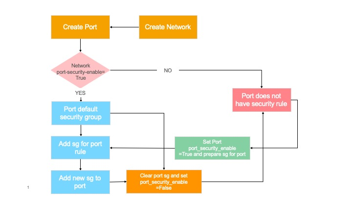
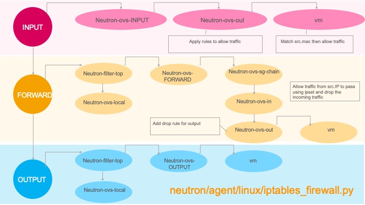
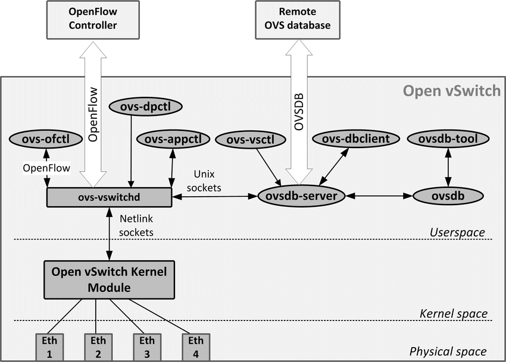

= OVS Programming Design
Eric Li <sze.li@futurewei.com>, Xiaodong Zhang <xzhang2@futurewei.com>
v0.1, 2020-04-07
:toc: right

== Architecture Overview

The Alcor Control Agent (ACA) running on the compute host provides the support of OVS dataplane programming through its dataplane abstraction layer interface. During startup time, ACA will be configured to which dataplace to use (OVS - default or Mizar), and then execute the corresponding code through the dataplane abstraction layer.

Unlike openstack neutron which uses at least 5 RPC messages to simply configure a new port and have chatty model between neutron server and neutron agents. Alcor design have only one message send from Alcor Controller to ACA, and that message would contain all the necessary network/port/security group/DHCP configuration to complete the configuration on compute/network host machine. 

The message can contain one or more (batching) configuration (e.g. 1000s new ports). ACA will parse the message in the Network State Handler module and then send the work item(s) to different ACA components for processing. It has the ability to execute multiple work items in parallel by default to greatly reduce the configuration time. Our previous data showed that parallel processing would provide 7 times gain compare do serial processing 100s of configurations. Once all the work items are completed, ACA will provide the one response message back to Alcor controller on success/fail status and also elapse time stamps for record tracking. To summerize, we are looking at just one message send to ACA and one reply back to Alcor control to configure one to 1000s of new ports.

=== Agent APIs for Core Network Programming

Here is the proposed implementation for Core Network programming interface:

[source,c++]
------------------------------------------------------------
// Core Network Programming Interface class
class Core_Network_Programming_Interface {
   public:
      // pure virtual functions providing interface framework.
      virtual int initialize() = 0;

      virtual int update_vpc_state_workitem(const VpcState current_VpcState,
                                            GoalStateOperationReply &gsOperationReply) = 0;

      virtual int update_subnet_state_workitem(const SubnetState current_SubnetState,
                                               GoalStateOperationReply &gsOperationReply) = 0;

      virtual int update_port_state_workitem(const PortState current_PortState,
                                             const alcorcontroller::GoalState &parsed_struct,
                                             GoalStateOperationReply &gsOperationReply) = 0;
};
------------------------------------------------------------

=== Communication with OVS

                    +--------------------+
                    |  Alcor Control     |
                    |     Agent          |
                    +--------------------+
                    |  ovsdb Management  |
                    |   Protocol         |
                    +--------------------+
         +----------------------------------------------+
                    +--------------------+
                    |  ovsdb-server      |
                    +--------------------+

=== Communication Protocol

TBD - XiaoDong - Note that we are closing on ovs-vsctl type of calls, we have not closed on how to do ovs-ofctl yet. Eric has not looked into that yet. One example is to do "ofctl.api.send_msg (packet) (OSKen)"

For ovs-vsctl type of commands like adding an OVS bridge or adding a new port etc, we will adapt the Open vSwitch Database Management Protocol (RFC 7047) <<rfc7047>>. ACA will be an OVSDB client and have full control of OVSDB usage using the protocol, including granular control of locking mechanism to the database table level. 

Since ACA is the only OVSDB client for the current design, we can do performance tuning by changing how ACA access ovsdb database. For example, ACA can perform manipulation of special database table serially, because it doesn't help to do it parallelly with lock, and then ACA can do other network configuration parallelly to achieve optimal performance.

== Workflow of Network Configuration Programming

TBD - XiaoDong

=== Basic Port Programming (VXLAN)

New Port Configuration on the compute host:

. ensure the br-int and br-tun bridges are properly created, if not, re-create them
. ensure the patch cable between br-int and br-tun is connected correctly
. configure the new port created by nova agent that's attached to br-int
.. can add more detail
. provision vlan tags for the new port for tenent network isolation within this host
. program the br-tun about this new port, so that encap/decap can be done there
.. "ovs-vsctl add-port set interface type=vxlan"
. reply to Alcor controller saying this port configuration is done

Peer compute host programming:

. in parallel of the new port configuration on its host, we also need to configuration all the peer compute host in the network about this new host that's part of vxlan network.
. each will reply to Alcor controller when done

The new port is consider as up when both configuration on its compute host and its peer compute host is completed.

=== Router Programming

Routing workflow between different EPs in the same subnet on different hosts

1. The packet from virtual machine 1 on the left reaches the br-int via the Linux bridge and is tagged with VLAN ID Tag
2. Reach br-tun, convert VLAN ID to Tunnel ID, send from VxLAN Tunnel, and reach another compute node
3. Go through the reverse process on another compute node to reach the virtual machine on the right

================================
Scenario B:
Routing workflow for accessing internet
1. Packet leaves the virtual machine, passes the Linux bridge, arrives at br-int, and is tagged with VLAN ID
2. Reach br-tun, convert VLAN ID to Tunnel ID
3. Enter the VxLAN channel from the physical network card
4. Network card from the VxLAN channel to the Neutron node
5. Reach the br-tun connected to the physical network card and convert the Tunnel ID to VLAN ID
6. Reach br-int, then router, router's NAT table will convert fixed IP address to floatiing IP address, and then route to br-ex
7. Go out from the physical network card connected to br-ex to the external network
================================
Scenario C:

Accessing an EP from an external network IP is the opposite process.

=== Security Group Programming

=== Network ACL Programming

== Implementation Details

TBD - XiaoDong/Eric

Initialization - ACA will initialize OVS during its startup time. We will likely start OVS service directly. <<start-ovs>>

Another option is to initialize OVS through command line:

[source,c++]
------------------------------------------------------------
a. start ovsdb-server: ovsdb-server --remote=punix:/usr/local/var/run/openvswitch/db.sock  \
  --remote=db:Open_vSwitch,Open_vSwitch,manager_options \
  --private-key=db:Open_vSwitch,SSL,private_key  \
  --certificate=db:Open_vSwitch,SSL,certificate     \
  --bootstrap-ca-cert=db:Open_vSwitch,SSL,ca_cert  \
  --log-file=/var/log/openvswitch/ovs-vswitchd.log \
  -vsyslog:dbg -vfile:dbg  --pidfile --detach

b. start vswitchd: ovs-vswitchd -v --pidfile --detach \
 --log-file=/var/log/openvswitch/ovs-vswitchd.log \
 -vconsole:err -vsyslog:info -vfile:info

c. use cmd to init: ovs-vsctl --no-wait init
------------------------------------------------------------

ACA will create the required br-int, br-tun bridges during agent init time, and recreated later during core network programming if needed.

== Comparison with Neutron OVS Agent

TBD - XiaoDong/Eric

How is the perf, latency and availablity etc compare to Neutron?

. need to measure the perf for large VPC - 64,000 EP?
. need to measure the perf for a lot of VPCs
. How are the OVS bridge performance when it is at scale? Is that the reason why it use multiple bridges (br-int, br-tun, br-ex)?

== Background of OVS Dataplane

"Open vSwitch is a production quality, multilayer virtual switch licensed under the open source Apache 2.0 license.  It is designed to enable massive network automation through programmatic extension, while still supporting standard management interfaces and protocols."<<ovs>>

We decided to support OVS dataplane not only because it is the main dataplane for OpenStack, it is also because its extensive features support as a software network switch implementation meeting our Alcor Cloud Native SDN requirements.

Some of the major OVS features needed by Alcor network control plan includes: <<why-ovs>>

. VXLAN/VLAN for tenet network isolation
. OpenFlow for L3 routing and flow inspection/maniplulation
. Hardware offloading to reduce on host CPU load  
. Remote access of network state database (OVSDB)

=== OVS Major Components

The below diagram show the major OVS components.<<ovs-components>>

== Pending Items

. what happen when there are multiple physical NICs on the system, which NIC do we pick to hook up to br-ex?

. what happen if host crashed, do we save the OVS config locally and restore it? Or we ask the Alcor controller for the whole set of cofiguration upon restart?

[bibliography]
== References

- [[[start-ovs,1]]] https://github.com/openstack/neutron/blob/c2d18cda6f3716965f0843da213985b4b7c6bb41/devstack/lib/ovs#L153
- [[[ovs,2]]] https://www.openvswitch.org/
- [[[why-ovs,3]]] https://github.com/openvswitch/ovs/blob/master/Documentation/intro/why-ovs.rst
- [[[ovs-components,4]]] https://www.researchgate.net/publication/311338103_A_Survey_on_the_Contributions_of_Software-Defined_Networking_to_Traffic_Engineering
- [[[rfc7047,7]]] https://tools.ietf.org/html/rfc7047
