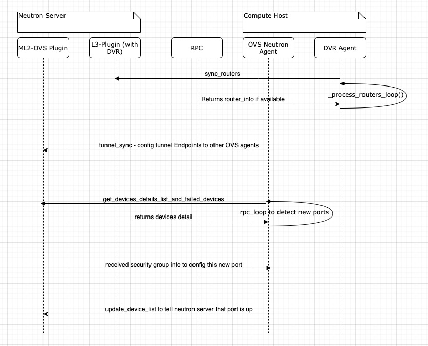
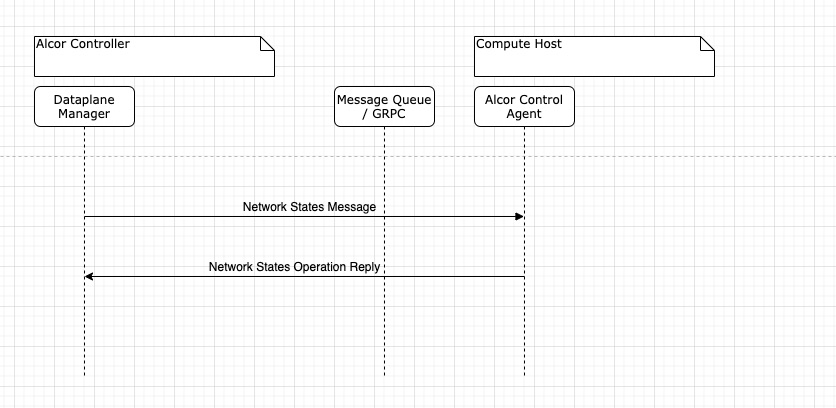
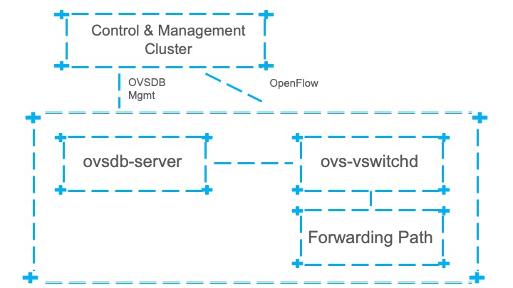

= OVS Programming Design
Eric Li <sze.li@futurewei.com>, Xiaodong Zhang <xzhang2@futurewei.com>, Liguang Xie <lxie@futurewei.com>
v0.1, 2020-04-07
:toc: right

== Architecture Overview

The Alcor Control Agent (ACA) running on the compute host provides the support of OVS dataplane programming through its dataplane abstraction layer interface.
During startup time, ACA will be configured to which dataplane to use (OVS - default or Mizar), and then execute the corresponding code through the dataplane abstraction layer.

=== Simplified Communication & Parallel Processing Capability

Unlike Openstack neutron which uses at least five RPC messages to simply configure a new port and have chatty model between neutron server and neutron agents.
Alcor design have only one message send from Alcor Controller to ACA,
and that message would contain all the necessary network/port/security group/DHCP configuration to complete the configuration on compute/network host machine.

The message can contain one or more (batching) configuration (e.g. thousands of new ports).
ACA will parse the message in the Network State Handler module and then send the work item(s) to different ACA components for processing.
It has the ability to execute multiple work items in parallel by default to greatly reduce the configuration time.
Our preliminary data showed that parallel processing would provide 7 times gain compare to serial processing hundreds of configurations.
Once all the work items are completed, ACA will provide the one response message back to Alcor controller on success/fail status and also elapse time stamps for record tracking.
To summarize, we are looking at just one message send to ACA and one reply back to Alcor control to configure one to thousands of new ports.

Neutron communication protocol is quite chatty, note that DHCP and smart NIC is not included below:

Alcor communication protocol is much simpler, it supports one or more VPC/Subnet/Port/Security group/DHCP configurations in a single network state message:

=== Agent APIs for Core Network Programming

Here is the proposed implementation for Core Network programming interface:

[source,c++]
------------------------------------------------------------
// Core Network Programming Interface class
namespace aca_net_programming_if
{
class Core_Network_Programming_Interface {
  public:
  // pure virtual functions providing interface framework.
  virtual int initialize() = 0;

  virtual int
  update_vpc_state_workitem(const alcorcontroller::VpcState current_VpcState,
                            const alcorcontroller::GoalStateOperationReply &gsOperationReply) = 0;

  virtual int
  update_subnet_state_workitem(const alcorcontroller::SubnetState current_SubnetState,
                               const alcorcontroller::GoalStateOperationReply &gsOperationReply) = 0;

  virtual int
  update_port_state_workitem(const alcorcontroller::PortState current_PortState,
                             const alcorcontroller::GoalState &parsed_struct,
                             const alcorcontroller::GoalStateOperationReply &gsOperationReply) = 0;
};
} // namespace aca_net_programming_if
------------------------------------------------------------

=== Communication with OVS

=== Communication Protocol

For ovs-vsctl Open vSwitch commands like adding an OVS bridge or adding a new port etc, we will adapt the Open vSwitch Database Management Protocol (RFC 7047) <<rfc7047>>.
ACA will be an OVSDB client and have full control of OVSDB usage using the protocol, including granular control of locking mechanism to the database table level.

Since ACA is the only OVSDB client for the current design, we can do performance tuning by changing how ACA access OVSDB database.
For example, ACA can perform manipulation of special database table serially, because it doesn't help to do it in parallel with lock,
and then ACA can do other network configuration parallelly to achieve optimal performance.

For ovs-ofctl OpenFlow commands like adding or remove flow rules, we will adapt the standard OpenFlow protocol<<openflow>>.
ACA will act as OpenFlow controller managing OVS as an OpenFlow switch. An OpenFlow switch has one or more flow table and perform packet matching and action.

OpenFlow protocol is the standard communication method between OpenFlow controller and network switch (virtual/physical).
With the popularity of hardware offloading, it is very likey that we can offload the flow table rules into NIC hardware.

TBD: XiaoDong to see if we can simply use OVS DB management protocol to directly inside OpenFlow rules into OVSDB.

== Workflow of Network Configuration Programming

=== Basic Port Programming (VXLAN)

New Port Configuration on the compute host:

. ensure the br-int and br-tun bridges are properly created, if not, re-create them
. ensure the patch cable between br-int and br-tun is connected correctly
. configure the new port created by nova agent that's attached to br-int
. provision vlan tags for the new port for tenant network isolation within this host
. program the br-tun about this new port, so that encap/decap can be done there
.. "ovs-vsctl add-port set interface type=vxlan"
. reply to Alcor controller saying this port configuration is done

Peer compute host programming:

. In parallel of the new port configuration on its host, we also need to configuration all the peer compute host in the network about this new host that's part of vxlan network.
. Each will reply to Alcor controller when done

The new port is consider as up when both configuration on its compute host and its peer compute host is completed.

== Implementation Details

Initialization - ACA will initialize OVS during its startup time. We will likely start OVS service directly. <<start-ovs>>

Another option is to initialize OVS through command line:

[source,c++]
------------------------------------------------------------
a. start ovsdb-server: ovsdb-server --remote=punix:/usr/local/var/run/openvswitch/db.sock  \
  --remote=db:Open_vSwitch,Open_vSwitch,manager_options \
  --private-key=db:Open_vSwitch,SSL,private_key  \
  --certificate=db:Open_vSwitch,SSL,certificate     \
  --bootstrap-ca-cert=db:Open_vSwitch,SSL,ca_cert  \
  --log-file=/var/log/openvswitch/ovs-vswitchd.log \
  -vsyslog:dbg -vfile:dbg  --pidfile --detach

b. start vswitchd: ovs-vswitchd -v --pidfile --detach \
 --log-file=/var/log/openvswitch/ovs-vswitchd.log \
 -vconsole:err -vsyslog:info -vfile:info

c. use cmd to init: ovs-vsctl --no-wait init
------------------------------------------------------------

ACA will create the required br-int, br-tun bridges during agent init time, and recreated later during core network programming if needed.

== Comparison with Neutron OVS Agent

TBD - XiaoDong/Eric

How is the perf, latency and availability etc compare to Neutron?

. Need to measure the perf for large VPC - 64,000 EP?
. Need to measure the perf for a lot of VPCs
. How are the OVS bridge performance when it is at scale? Is that the reason why it use multiple bridges (br-int, br-tun, br-ex)?

== Background of OVS Dataplane

"Open vSwitch is a production quality, multilayer virtual switch licensed under the open source Apache 2.0 license.
It is designed to enable massive network automation through programmatic extension, while still supporting standard management interfaces and protocols."<<ovs>>

We decided to support OVS dataplane not only because it is the main dataplane for OpenStack,
it is also because its extensive features support as a software network switch implementation meeting our Alcor Cloud Native SDN requirements.

Some of the major OVS features needed by Alcor network control plan includes: <<why-ovs>>

. VXLAN/VLAN for tenet network isolation
. OpenFlow for L3 routing and flow inspection/manipulation
. Hardware offloading to reduce on host CPU load  
. Remote access of network state database (OVSDB)

=== OVS Major Components

The below diagram show the major OVS components.<<ovs-components>>

image::images/ovs_components.png["OVS Component diagram", width=800, link="images/ovs_components.png"]

== Pending Items

. what happen when there are multiple physical NICs on the system, which NIC do we pick to hook up to external and internal traffic?

. what happen if host crashed, do we just leverage the ovsdb storedd data? Or we ask the Alcor controller for the whole set of configuration upon restart?

[bibliography]
== References

- [[[rfc7047,1]]] https://tools.ietf.org/html/rfc7047
- [[[openflow,2]]] https://www.opennetworking.org/images/stories/downloads/sdn-resources/onf-specifications/openflow/openflow-spec-v1.4.0.pdf
- [[[start-ovs,3]]] https://github.com/openstack/neutron/blob/c2d18cda6f3716965f0843da213985b4b7c6bb41/devstack/lib/ovs#L153
- [[[ovs,4]]] https://www.openvswitch.org/
- [[[why-ovs,5]]] https://github.com/openvswitch/ovs/blob/master/Documentation/intro/why-ovs.rst
- [[[ovs-components,6]]] https://www.researchgate.net/publication/311338103_A_Survey_on_the_Contributions_of_Software-Defined_Networking_to_Traffic_Engineering
