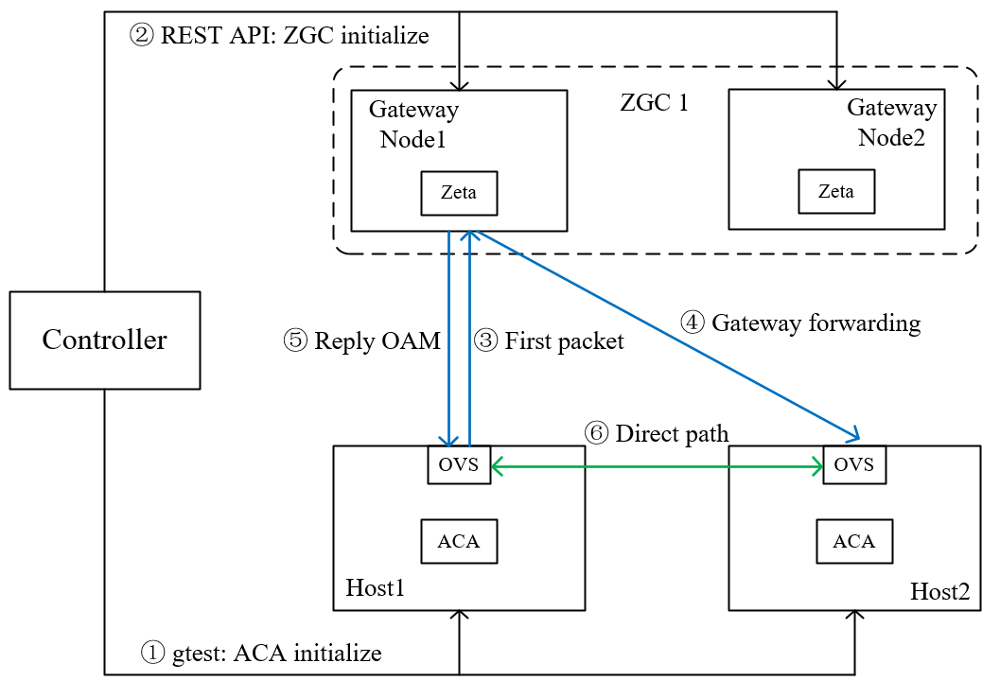

## Zeta+ACA environment setup and test cases

### 1. Experimental topology

Figure 1. Experimental topology

#### 1.1 Gateway node

-   ZGC 1:
    -   zeta API ip: 172.16.50.8

#### 1.2 Computer node

-   computer node1 &nbsp;&nbsp; ip: 172.16.50.221
-   computer node2 &nbsp;&nbsp; ip: 172.16.50.222
-   ACA on these two computer nodes has been configured.

### 2. Setup workflow

#### Step 1: REST API - ZGC information and gateway nodes initialize

-   call REST API to create ZGC 

-   call REST API to add VPC and get zgc entry points info

-   call REST API to notify ZGC the ports created on each ACA

#### Step 2: gtest - ACA test cases initialize

-   Use gtest to configure gateway path, and add a openflow rule on both computer nodes to receive oam packets
-   The steps of gtest about Zeta mainly have the following steps:
    -   delete the old br-int and br-tun, and create new br-int and br-tun, and patch ports between br-int and br-tun;
    -   create a port and the information of this port should be the same as that posted to ZGC by REST API;
    -   add group entry configure gateway path;
    -   the ports on the two computing nodes begin to communicate. 
- Observe whether the gateway path is successful through "n_packet";

#### Step 3: First packet upload to gateways by default

#### Step 4: First packet forwarded to destination by gateawy

#### Step 5: Gateways reply OAM packet

#### Step 6: Create direct path

### Test Cases

#### Test Case 1: Create ZGC

- The controller uses ZGC REST APIs to create a zeta gateway cluster.
  
    Method: Post
    Request: http://172.16.50.8/zgcs

        data:
        {
            "name": "ZGC_test",
            "description": "ZGC_test",
            "ip_start": "172.16.150.80",
            "ip_end": "172.16.150.95",
            "port_ibo": "8300",
            "overlay_type": "vxlan"
        }

- When response code is 200, the controller create a ZGC successfully. 

#### Test Case 2: Add nodes to ZGC

- The controller adds nodes to ZGC.

    Method: Post
    Request: http://172.16.50.8/nodes

        data:
        {
            "zgc_id": "zgc_id",
            "description": "znode90",
            "name": "znode90",
            "ip_control": "172.16.50.190",
            "id_control": "ubuntu",
            "pwd_control": "Lab12345",
            "inf_tenant": "ens4",
            "mac_tenant": "52:54:00:a9:3f:b9",
            "inf_zgc": "ens3",
            "mac_zgc": "52:54:00:1a:cf:38"
        }
      
- When response code is 201, the controller adds a node successfully. 

#### Test Case 3: Add VPC

- The controller adds a VPC to the Zeta management plane.
  
    Method: POST
    Request: http://172.16.50.8/vpcs

        data:
        {
            "vpc_id": "3dda2801-d675-4688-a63f-dcda8d327f61",
            "vni": "1"
        }

- When response code is 201, the controller add a VPC successfully.

#### Test Case 4: Add Port

- The controller add the information of computer instance ports created on computer nodes to the Zeta management plane.

    Method: POST
    Request: http://172.16.50.8/ports

        data:
        [
            {
                "port_id": "333d4fae-7dec-11d0-a765-00a0c9341120",
                "vpc_id": "3dda2801-d675-4688-a63f-dcda8d327f61",
                "ips_port": [
                {
                    "ip": "10.10.0.92",
                    "vip": ""
                }
                ],
                "mac_port": "cc:dd:ee:ff:11:22",
                "ip_node": "172.16.150.221",
                "mac_node": "64:6e:97:0d:80:a9"
            },
            {
                "port_id": "99976feae-7dec-11d0-a765-00a0c9342230",
                "vpc_id": "3dda2801-d675-4688-a63f-dcda8d327f61",
                "ips_port": [
                {
                    "ip": "10.10.0.93",
                    "vip": ""
                }
        ]       ,
                "mac_port": "6c:dd:ee:ff:11:32",
                "ip_node": "172.16.150.222",
                "mac_node": "64:6e:97:1c:8e:65"
            }
        ]

- When response code is 201, the controller add a port successfully.

#### Test Case 5: Verify Gateway Path and Direct Path 

- Add a TEST function about Zeta, and recompile ACA on both computer nodes.
- The controller sends the port information that needs to be created to ACA on computer nodes by transferring files.
- Execute gtest command on both computer nodes. 
  
    On computer node 172.16.62.250, run

        ./build/tests/aca_tests --gtest_also_run_disabled_tests --gtest_filter=*DISABLED_zeta_scale_container
  
    On computer node 172.16.62.249, run

        ./build/tests/aca_tests --gtest_also_run_disabled_tests --gtest_filter=*DISABLED_zeta_scale_container

- Perform ping operation from parent to child and from child to parent to verify the connectivity between ports.

