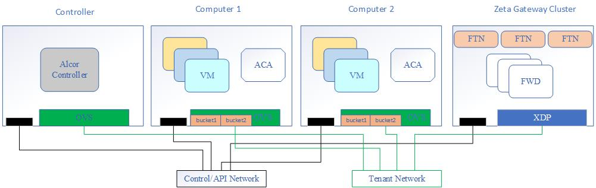
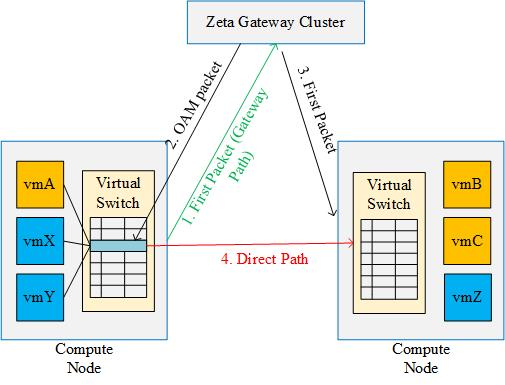

= Zeta Integration Design

== Architecture Overview

Figure 1 Highlevel Architecture

Figure 2 Illustion of Gateway Path and Direct Path

. Control/API Network. Alcor server configures the group entries and the buckets in the group entries for each computing node. 
Each group entry corresponds to a Zeta Gateway Cluster (ZGC). Each bucket in the group entry corresponds to a gateway in ZGC.

. Tenant Network. The gateway node in ZGC is responsible for delivering the rules to ACA on computing nodes when two VMs communicate for the first time. 
ACA as the openflow controller will install rules on ovs.

. Gateway/Direct path. The path between the gateway node and the computing node is called the gateway path whereas VM to VM direct communication is called direct path. How to build gateway/direct path will be introduced later.

    .. When two VMs talk for the first time, the first packet will go through the gateway path;
    .. The gateway node receive the first packet and than send an OAM packet to the source host;
    .. The gateway node send the first packet (may be more than one due to delay) to the destination host;
    .. The source host receive the OAM packet then build VM to VM direct path. After this, all packets go throuth the direct path;

== Bucketing System Design on Compute Node

The information of the ZGC cluster will be sent to computing node by Alcor controller when a host is up. When a VM boots up, 
if the compute node already have a VM with the same VPC, there is no need to configure flow table and group table.
The packet will match the internal VLAN in the flow table to determine which group rule is used.
Each group rule can be configured with a few buckets, and each bucket specifies a gateway node.
After determining which group rule will handle the packet, the group rules support Round Robin algorithm to map packets to a bucket. 

Figure 2 Packet Processing for Gateway Path and Direct Path

image::../images/zeta_packet_processing.jpg["zeta_packet_processing", width=800, link="zeta_packet_processing.jpg"]

Figure 3 Example Topology

image::../images/zeta_integration_example.jpg["example", width=600, link="zeta_integration_example.jpg"]

The following workflow is based on the figure above.

=== Workflow for Gateway Path Configuration

Gateway path configuration happens when a VM boots up and there is no existing VM port belongs to the same VPC on the host.

. Alcor controller send goal state message which includes ZGC information (MAC and IP of FWDs) to ACA on the host;

. ACA receives the message and extract information of ZGC;

. ACA determines whether the gateway path entry which has the same VLAN id has been installed in the flow table.

. If not, ACA builds tunnel between gateway nodes and the host, and configure ovs to install flow rules and group rules to build gateway path;

    .. When container 192.168.1.71 on host 172.16.62.237 talks to container 192.168.1.81 on host 172.16.62.238. The flow rules may look like this:

    cookie=0x0, duration=85506.933s, table=0, n_packets=3792, n_bytes=5275816, priority=1,in_port="patch-int" actions=resubmit(,2)
    cookie=0x0, duration=170337.699s, table=2, n_packets=111, n_bytes=4662, priority=0,dl_dst=01:00:00:00:00:00/01:00:00:00:00:00 actions=resubmit(,22)
    cookie=0x0, duration=85323.301s, table=22, n_packets=111, n_bytes=4774, priority=1,dl_vlan=100 actions=strip_vlan,load:0x1->NXM_NX_TUN_ID[],group:100

    .. The group rule may look like this:

    group_id=100,type=select,bucket=output:vxlan231,bucket=output:vxlan232

=== Workflow for Group Rule Delete

The ACA has the information about VLAN tag owned by each VM. The deletion of flow rules and group rules may occur when a VM brings down or be migrated on a host;

. When a VM brings down or be migrated, ACA finds the VLAN of this VM;

. ACA finds if there are other VM with the same VLAN ;

. If not, delete the flow rule which match the VLAN of offline VM, and record the group id in the action of the deleted flow rule;

. Find in the flow table if there are other rules for the action of this group id;

. If not, delete this group rule;

=== Workflow for VM to VM Direct Path Configuration

This happens when a gateway node receive the first packet from compute node, then send OAM packet to the computing node.

. A gateway node receives the first packet from a compute node;

. The gateway node extracts the header information of this packet and route the packet to destination host;

. The gateway node sends the OAM packet to the computing node;

. ACA parses OAM packet and extract information about the IP and mac of destination host and VM;

. ACA add higher priority rule in flow table to support VM to VM direct path;
    .. The flow rules may look like this:

    cookie=0x0, duration=13184.269s, table=0, n_packets=6, n_bytes=476, priority=2,in_port="patch-int",dl_dst=f6:0e:05:38:0b:72 actions=resubmit(,24)
    cookie=0x0, duration=13152.691s, table=24, n_packets=6, n_bytes=476, priority=1,dl_vlan=100 actions=strip_vlan,load:0x1->NXM_NX_TUN_ID[],output:vxlan238

=== OAM Packet Usage and Handling on ACA

When ACA receive OAM packet, it needs to parse it and decide what the action is.

. ACA receives the OAM packet;

. ACA extracts OP_Code to determin whether to add (0x0000 0000) or delete (0x0000 0001) rules;

. ACA extracts OP_Data in OAM packet;

. According to OP_Code, ACA uses OP_Data to add or delete rules on ovs;

== Cross-subnet Communication 

VM1 on Host1 starts to talk to VM2 on Host2. VM1 and VM2 belong to the same VPC, but different subnets. Thus, the communication needs the help of DVR in ACA.

. VM1 sends a packet to VM2;

. br-int on Host receives the packet. The source MAC of this packet is MAC_VM1, and the destination MAC is MAC_Gateway_VM1;

. br-int adds VLAN and sends the packet to ACA based on the on-demand routing implementation (issue#134);

. ACA matches MAC_Gateway_Host1 and adds on-demand openflow rule to flow table, and sends the first packet back to br-int;

. br_int sends the packet to br_tun; Convert the source MAC to MAC_Host1_DVR and the destination MAC to MAC_VM2 with on-demand routing rule;

. If there is no direct path, send the packet to Zeta gateway path. Otherwise, this packet will go through direct VM path;

== Example for OpenFlow Rule Setting

In this section, we will use the example topology described in Figure 3 to illustrate how to configure gateway path and direct path in the form of command line.

=== Case 1: Gateway Path Configuration

. Compute Node 1 (172.16.62.237)

The command lines for gateway path configuration are as follows:

    # ovs-ofctl -O OpenFlow13 add-group br-tun group_id=100,type=select,bucket=output:vxlan231,bucket=output:vxlan232
    # ovs-ofctl -O OpenFlow13 add-group br-tun group_id=200,type=select,bucket=output:vxlan233,bucket=output:vxlan234
    # ovs-ofctl add-flow br-tun table=22,priority=50,dl_vlan=100,actions="strip_vlan,load:0x1->NXM_NX_TUN_ID[],group:100"
    # ovs-ofctl add-flow br-tun table=22,priority=50,dl_vlan=200,actions="strip_vlan,load:0x2->NXM_NX_TUN_ID[],group:200"
    # ovs-ofctl add-flow br-tun table=0,priority=25,in_port="vxlan231",actions="resubmit(,4)"
    # ovs-ofctl add-flow br-tun table=0,priority=25,in_port="vxlan232",actions="resubmit(,4)"
    # ovs-ofctl add-flow br-tun table=0,priority=25,in_port="vxlan233",actions="resubmit(,4)"
    # ovs-ofctl add-flow br-tun table=0,priority=25,in_port="vxlan234",actions="resubmit(,4)"
    # ovs-ofctl add-flow br-tun table=4,priority=1,tun_id=0x1,actions="mod_vlan_vid:100,output:"patch-int""
    # ovs-ofctl add-flow br-tun table=4,priority=1,tun_id=0x2,actions="mod_vlan_vid:200,output:"patch-int""

After adding OpenFlow rules, the flow tables in br-tun are as follows:

    cookie=0x0, duration=806.968s, table=0, n_packets=0, n_bytes=0, priority=1,in_port="patch-int" actions=resubmit(,2)
    cookie=0x0, duration=41.454s, table=0, n_packets=0, n_bytes=0, priority=25,in_port=vxlan231 actions=resubmit(,4)
    cookie=0x0, duration=35.429s, table=0, n_packets=0, n_bytes=0, priority=25,in_port=vxlan232 actions=resubmit(,4)
    cookie=0x0, duration=29.654s, table=0, n_packets=0, n_bytes=0, priority=25,in_port=vxlan233 actions=resubmit(,4)
    cookie=0x0, duration=23.110s, table=0, n_packets=0, n_bytes=0, priority=25,in_port=vxlan234 actions=resubmit(,4)
    cookie=0x0, duration=186.068s, table=2, n_packets=0, n_bytes=0, priority=1,dl_dst=00:00:00:00:00:00/01:00:00:00:00:00 actions=resubmit(,20)
    cookie=0x0, duration=174.437s, table=2, n_packets=0, n_bytes=0, priority=1,dl_dst=01:00:00:00:00:00/01:00:00:00:00:00 actions=resubmit(,22)
    cookie=0x0, duration=14.078s, table=4, n_packets=0, n_bytes=0, priority=1,tun_id=0x1 actions=mod_vlan_vid:100,output:"patch-int"
    cookie=0x0, duration=7.705s, table=4, n_packets=0, n_bytes=0, priority=1,tun_id=0x2 actions=mod_vlan_vid:200,output:"patch-int"
    cookie=0x0, duration=159.449s, table=20, n_packets=0, n_bytes=0, priority=1 actions=resubmit(,22)
    cookie=0x0, duration=63.974s, table=22, n_packets=0, n_bytes=0, priority=50,dl_vlan=100 actions=strip_vlan,load:0x1->NXM_NX_TUN_ID[],group:100
    cookie=0x0, duration=57.318s, table=22, n_packets=0, n_bytes=0, priority=50,dl_vlan=200 actions=strip_vlan,load:0x2->NXM_NX_TUN_ID[],group:200

. Compute Node 2 (172.168.62.238)

The command lines for gateway path configuration are as follows:

    # ovs-ofctl -O OpenFlow13 add-group br-tun group_id=100,type=select,bucket=output:vxlan231,bucket=output:vxlan232
    # ovs-ofctl -O OpenFlow13 add-group br-tun group_id=200,type=select,bucket=output:vxlan233,bucket=output:vxlan234
    # ovs-ofctl add-flow br-tun table=22,priority=50,dl_vlan=100,actions="strip_vlan,load:0x1->NXM_NX_TUN_ID[],group:100"
    # ovs-ofctl add-flow br-tun table=22,priority=50,dl_vlan=200,actions="strip_vlan,load:0x2->NXM_NX_TUN_ID[],group:200"
    # ovs-ofctl add-flow br-tun table=0,priority=25,in_port="vxlan231",actions="resubmit(,4)"
    # ovs-ofctl add-flow br-tun table=0,priority=25,in_port="vxlan232",actions="resubmit(,4)"
    # ovs-ofctl add-flow br-tun table=0,priority=25,in_port="vxlan233",actions="resubmit(,4)"
    # ovs-ofctl add-flow br-tun table=0,priority=25,in_port="vxlan234",actions="resubmit(,4)"
    # ovs-ofctl add-flow br-tun table=4,priority=1,tun_id=0x1,actions="mod_vlan_vid:100,output:"patch-int""
    # ovs-ofctl add-flow br-tun table=4,priority=1,tun_id=0x2,actions="mod_vlan_vid:200,output:"patch-int""

After adding OpenFlow rules, the flow tables in br-tun are as follows:

 cookie=0x0, duration=129.879s, table=0, n_packets=0, n_bytes=0, priority=1,in_port="patch-int" actions=resubmit(,2)
 cookie=0x0, duration=75.727s, table=0, n_packets=0, n_bytes=0, priority=25,in_port=vxlan231 actions=resubmit(,4)
 cookie=0x0, duration=69.486s, table=0, n_packets=0, n_bytes=0, priority=25,in_port=vxlan232 actions=resubmit(,4)
 cookie=0x0, duration=63.983s, table=0, n_packets=0, n_bytes=0, priority=25,in_port=vxlan233 actions=resubmit(,4)
 cookie=0x0, duration=18.685s, table=0, n_packets=0, n_bytes=0, priority=25,in_port=vxlan234 actions=resubmit(,4)
 cookie=0x0, duration=123.823s, table=2, n_packets=0, n_bytes=0, priority=1,dl_dst=00:00:00:00:00:00/01:00:00:00:00:00 actions=resubmit(,20)
 cookie=0x0, duration=117.255s, table=2, n_packets=0, n_bytes=0, priority=1,dl_dst=01:00:00:00:00:00/01:00:00:00:00:00 actions=resubmit(,22)
 cookie=0x0, duration=13.270s, table=4, n_packets=0, n_bytes=0, priority=1,tun_id=0x1 actions=mod_vlan_vid:100,output:"patch-int"
 cookie=0x0, duration=7.172s, table=4, n_packets=0, n_bytes=0, priority=1,tun_id=0x2 actions=mod_vlan_vid:200,output:"patch-int"
 cookie=0x0, duration=59.449s, table=20, n_packets=0, n_bytes=0, priority=1 actions=resubmit(,22)
 cookie=0x0, duration=98.415s, table=22, n_packets=0, n_bytes=0, priority=50,dl_vlan=100 actions=strip_vlan,load:0x1->NXM_NX_TUN_ID[],group:100
 cookie=0x0, duration=90.679s, table=22, n_packets=0, n_bytes=0, priority=50,dl_vlan=200 actions=strip_vlan,load:0x2->NXM_NX_TUN_ID[],group:200

=== Case 2: Direct Path Configuration

After the first packet from docker71 send to the gateway node, the gateway node will send an OAM packet to the compute node7, and a direct path between docker71 and docker81 will be built.

. Computer Node 1 (172.16.62.237)

 # ovs-ofctl add-flow br-tun table=20,priority=50,dl_vlan=100,ip,nw_src=192.168.1.71,nw_dst=192.168.1.81,actions="strip_vlan,load:0x1->NXM_NX_TUN_ID[],output:"vxlan238""
 # ovs-ofctl add-flow br-tun table=0,priority=25,in_port="vxlan238",actions="resubmit(,4)"

. Computer Node 2 (172.16.62.238)

 # ovs-ofctl add-flow br-tun table=20,priority=50,dl_vlan=100,ip,nw_src=192.168.1.81,nw_dst=192.168.1.71,actions="strip_vlan,load:0x1->NXM_NX_TUN_ID[],output:"vxlan237""
 # ovs-ofctl add-flow br-tun table=0,priority=25,in_port="vxlan237",actions="resubmit(,4)"

== Code changes

=== OAM Packet Handling
. include/aca_oam_server.h
    .. Define the data struct of op_data in OAM packet;
    .. Define the interface for receiving and parsing OAM packets;
    .. Define the interface for establishing direct path between VMs;

. include/aca_zeta_programming.h
    .. Define the data struct about gateway path configuration;
    .. Define the interface for adding, deleting, checking and modifying group entries;

. src/zeta/aca_oam_server.cpp
    .. Implement the interface in the include/aca_oam_server.h 

. src/zeta/aca_zeta_programming.cpp
    .. Implement the interface in the include/aca_zeta_programming.h 

=== Test Code Updates

. test/gtest/aca_test_zeta_programming.cpp
    .. Verify gateway path and direct path

