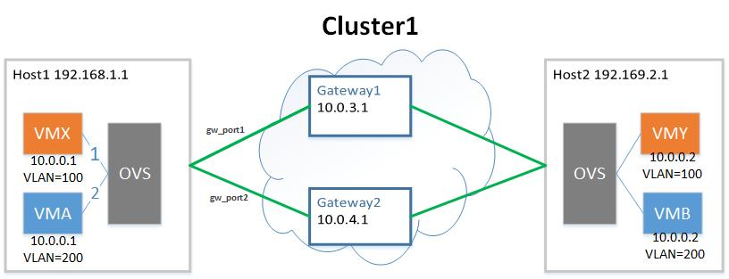
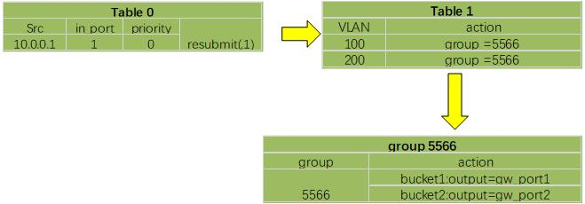
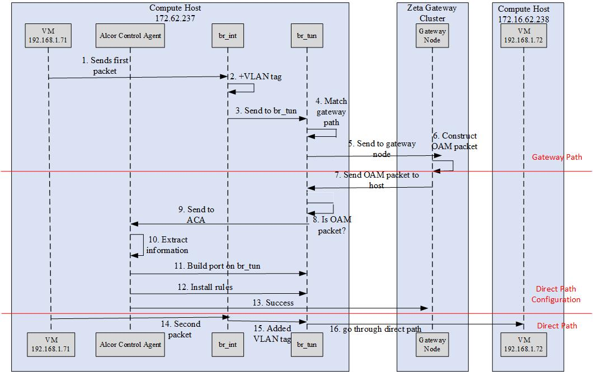

= Zeta Integration Design

== Architecture Overview

image::images/zeta_integration_high_level.jpg["highlevel Architecture", width=800, link="zeta_integration_high_level.jpg"]

image::images/gateway_direct_path.jpg["gateway_direct_path", width=600, link="gateway_direct_path.jpg"]

1. Control/API Network. Alcor server configures the group entries and the buckets in the group entries for each computing node. 
Each group entry corresponds to a Zeta Gateway Cluster (ZGC). Each bucket in the group entry corresponds to a gateway in ZGC.

2. Tenant Network. The gateway node in ZGC is responsible for delivering the rules to ACA on computing nodes when two VMs communicate for the first time. 
ACA as the openflow controller will install rules on ovs.

3. Gateway/Direct path. The path between the gateway node and the computing node is called the gateway path whereas VM to VM direct communication is called direct path.

== Bucketing System Design on Compute Node

The information of the ZGC cluster will be when to computing node when needed from Alcor controller. When a VM boots up, 
if the compute node already have a VM with the same VPC, there is no need to configure flow table and group table.
The packet will match the internal VLAN in the flow table to determine which group rule is used.
Each group rule can be configured with a few buckets, and each bucket specifies a gateway node.
After determining which group rule will handle the packet, the group rules support Round Robin algorithm to map packets to a bucket. 

We use an example to illustrate the gateway path. VMX and VMY belongs to VPC1. The flows of VPC1 is mapped to a zeta gateway cluster, which includes two gateway nodes gateway1 and gateway2. The gw_port1 and gw_port2 ports of computing node1 are respectively corresponding to the gateway nodes gateway1 and gateway2. Then we deploy a group entry on computing node1, the group identifier is 4, and the action buckets are: bucket1:output=gw_port1; bucket2:output=gw_port2. In addition, by deploying a low-priority flow entry, the flow of the VPC1 that does not match the high-priority flow entry (vm-vm direct path forwarding entry) is directed to the group entry 4. The flow of VPC1 will be directed to group entry 4, and will be forwarded to the gateway node gateway1 or gateway2 through the group entry 4. Through the flow table + group table, you can achieve the mapping of vpc to the gateway node cluster.

== Workflow Diagram for Gateway Path Configuration

Gateway path configuration happens when a VM boot up and there is no existing VM port belongs to the same VPC on the host.

1. Alcor controller send goal state message to ACA on the host for new port configuration;

2. ACA receieves the message and extract information of ZGC from the database;

3. ACA configure ovs to install flow rule and group rule;

== Group Rule Delete

The ACA has the information about VLAN tag owned by each VM. The group table delete may occur when a VM brings down or be migrated on a host;

1. When a VM brings down or be migrated, ACA finds the VLAN of this VM;

2. ACA finds if there are other VM with the same VLAN ;

3. If not, delete the group rule which match the VLAN of offline VM;

== Workflow Diagram for VM to VM Direct Path Configuration

This happens when a gateway node receieve packets from compute node, then send OAM packet to the computing node.

1. A gateway node receive the first packet from a compute node;

2. The gateway node extract the header information of this packet and route the packet to destination host;

3. The gateway node send the OAM packet to the computing node;

4. ACA on the compute node receive the OAM packet;

5. ACA configure the flow table on ovs after learning about the destination host IP and mac, also the destination port IP and mac;

6. ACA add higher priority rule the flow table to enable VM to VM direct communication;

== OAM Packet Usage and Handling on ACA

1. ACA receieve the OAM packet;

2. The AVA_OVS_Control module parse the OAM packet and determine whether to add or delete flow rules based on the OAM packet;

3. ACA build a port on the source host to the destination host;

4. ACA install flow rules with higher priority than gateway path;

== Workflow Diagram for Bucketing and OAM Handling.

TBD

== Code changes

=== Goal State Message Change from Alcor Server to ACA

TBD

=== OAM Packet Handling

TBD

=== Test Code Updates

TBD

