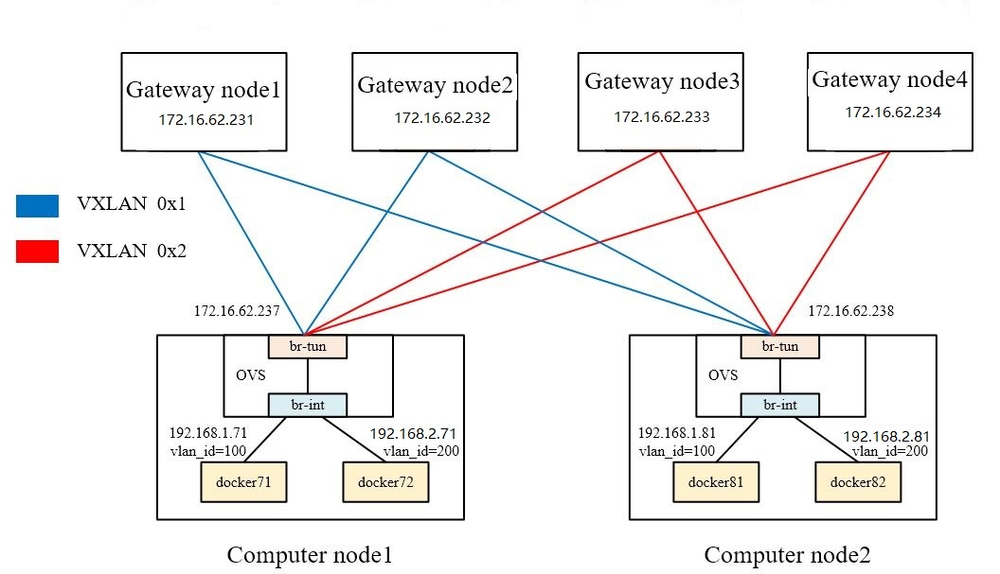

= Zeta Integration Design

== Architecture Overview

image::images/zeta_integration_high level.jpg["highlevel Architecture", width=800, link="zeta_integration_high level.jpg"]

1. Management Network. Alcor server configures the group entries and the buckets in the group entries for each computing node. 
Each group entry corresponds to a Zeta Gateway Cluster (ZGC). Each bucket in the group entry corresponds to a gateway in ZGC.

2. Gateway Network. The gateway node in ZGC is responsible for delivering the rules to ACA on computing nodes when two VMs communicate for the first time. 
ACA as the openflow controller will install rules on ovs.

== Bucketing System Design on Compute Node

We configure a set of group rules in group table which is supported by OpenFlow on ovs. 
The packet will match the VPC-id in the flow table to determine which group rule is used by this packet.
Each group rule can be configured with a few buckets, and each bucket specifies a gateway node.
Since the number of gateway clusters will not be too large, all the group tables related to the gateway cluster can be configured on the computing node.
In this case, when a VM goes online, there is no need to spend time configuring the group rules for it.
Thus, the number of buckets on each computing node is the same as the number of gateway cluster.
After determining which group rule can handle the packet, the group rules support hash function to map a packet to a bucket. 
Ths hash field cna be specified as source MAC, source IP, destination MAC and destination IP.

We use an example to illustrate. As shown in the figure above, there are four VMs belonging to the same VPC. 
VM1 on Host 1 initiates communication to VM3 on Host 2.
Since this is the first communication between these two virtual machines, there is no direct path to VM3 on Host 1.
The packet will first match the flow table on Host 1 to find group 1 on group table. 
By hasing the MAC and IP values, ovs can know which gateway to send packets to.
Then the gateway node recieve the packet and find the IP of Host 2 where VM3 is located.
The gateway node send the IP of Host 2 to ACA on Host 1. 
Then ACA will create a br-tun related to Host 2 on ovs.
After this, data packets between VM1 and VM3 do not need to pass through the gateway node.

TBD

=== Example on openflow rules for bucketing and OAM packet send to ACA

TBD

== OAM Packet Usage and Handling

TBD

=== Worklow Diagram for Bucketing and OAM Handling.

TBD

== Code changes

=== Goal State Message Change from Alcor Server to ACA

TBD

=== OAM Packet Handling

TBD

=== Test Code Updates

TBD

